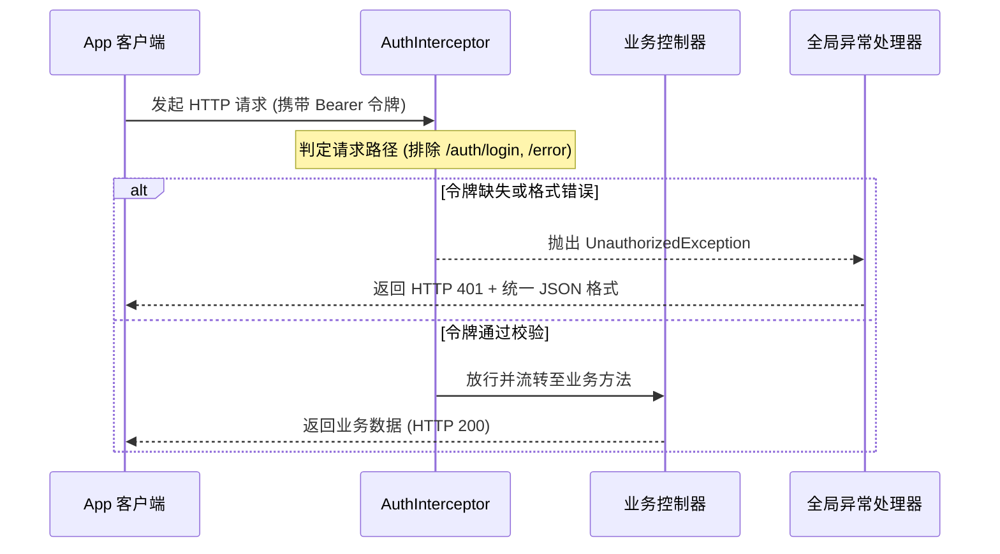
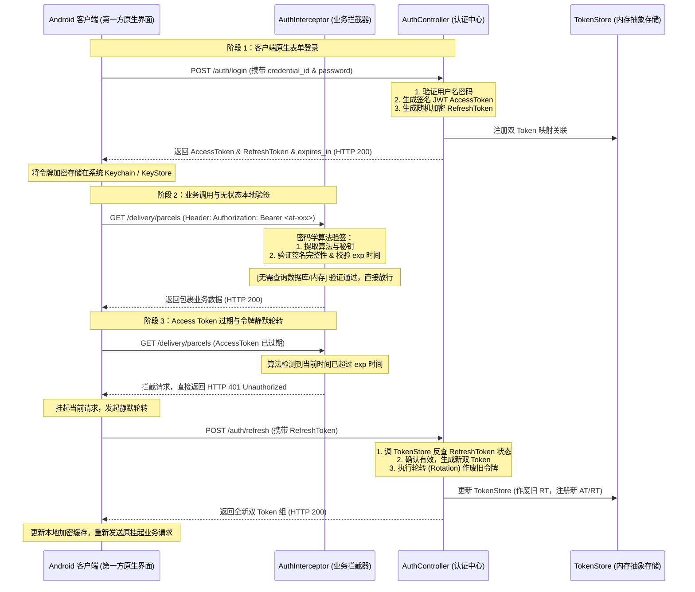

# EasyDelivery 后台 API 设计文档 (中文版)

本文件详细记录了 EasyDelivery Spring Boot 后台服务的设计结构、Maven 模块划分以及与 Android 客户端对接的 API 接口规范。

## 1. 架构设计要点

* **开发语言与框架**：Java 17，Spring Boot 3.3.x
* **多模块架构**：虽然第一版本以单体运行，但通过 Maven 模块进行物理拆分，确保未来微服务化重构的低成本。
* **内存数据源**：采用线程安全的 `MemoryDataStore` 维护运行时数据（司机、包裹、扫描批次和报告），无需配置外部 MySQL 数据库即可开箱即用运行。
* **统一响应体**：所有 API 响应体均遵循 `biz_code` (业务状态码)、`biz_message` (业务描述) 和 `biz_data` (数据载荷) 的标准规范。

---

## 2. Maven 模块划分

```
easydelivery-backend (父 POM)
  ├── easydelivery-common    (公共模块: DTO, 基础响应, 内存模拟数据库)
  ├── easydelivery-auth      (认证模块: 登录与 token 校验)
  ├── easydelivery-delivery  (配送模块: 包裹列表获取, POD 妥投上传及重试)
  ├── easydelivery-scan      (扫描模块: 包裹扫码, 批次管理, 报告生成, 批次审核)
  └── easydelivery-app       (装配模块: Spring Boot 启动入口与主配置文件)
```

---

## 3. 详细 API 接口规范

所有接口路径相对于服务根路径（例如 `http://localhost:9000/`）。

### A. 认证模块 (Auth Module)

#### 1. 司机登录
* **路径**：`POST /auth/login`
* **请求头**：`Content-Type: application/json`
* **请求体**：
  ```json
  {
    "credential_id": "driver123",
    "password": "password123"
  }
  ```
* **响应体 (成功)**：
  ```json
  {
    "biz_code": "COMMON.QUERY.SUCCESS",
    "biz_message": "Login Success",
    "biz_data": {
      "access_token": "mock-token-session-jwt-12345"
    }
  }
  ```

---

### B. 配送模块 (Delivery Module)

#### 1. 获取派送中包裹列表
* **路径**：`GET /delivery/parcels/delivering?driver_id={driverId}`
* **请求头**：`Authorization: Bearer <token>`
* **响应体**：
  ```json
  {
    "biz_code": "COMMON.QUERY.SUCCESS",
    "biz_message": "Success",
    "biz_data": [
      {
        "order_id": 10001,
        "order_sn": "SN10001",
        "tracking_no": "BAUNI000300014438615",
        "goods_type": 1,
        "express_type": 1,
        "route_no": 12,
        "state": 2, 
        "name": "John Doe",
        "mobile": "1234567890",
        "address": "123 Main St, Vancouver, BC",
        "zipcode": "V6B 1A1",
        "lat": "49.2827",
        "lng": "-123.1207"
      }
    ]
  }
  ```

#### 2. 获取未扫描包裹任务列表
* **路径**：`GET /delivery/parcels/tasks?criteria=UNSCANNED&driver_id={driverId}`
* **请求头**：`Authorization: Bearer <token>`
* **响应体**：
  *(数据结构同上，其中包的 `scan_status` 为 0)*

#### 3. 妥投上传 (POD Upload)
* **路径**：`POST /delivery`
* **请求头**：`Authorization: Bearer <token>`, `Content-Type: multipart/form-data`
* **表单参数**：
  * `order_id` (文本)
  * `longitude` (文本)
  * `latitude` (文本)
  * `delivery_result` (文本, `0` 表示妥投成功, `1` 表示配送失败)
  * `failed_reason` (文本, 失败原因码, 失败时必传)
  * `recipient_name` (文本, 签收人姓名, 可选)
  * `pod_images[]` (文件部分, 对应妥投照片)
* **响应体**：
  ```json
  {
    "biz_code": "COMMON.QUERY.SUCCESS",
    "biz_message": "Upload successful",
    "biz_data": null
  }
  ```

#### 4. 重试配送上传 (Retry Delivery)
* **路径**：`POST /delivery/retry`
* **请求头**：`Authorization: Bearer <token>`, `Content-Type: multipart/form-data`
* **表单参数**：
  * `order_id` (文本)
  * `longitude` (文本)
  * `latitude` (文本)
  * `driver_id` (文本)
  * `pod_img[]` (文件部分, 对应重新派送相关照片)
* **响应体**：
  ```json
  {
    "biz_code": "COMMON.QUERY.SUCCESS",
    "biz_message": "Retry recorded",
    "biz_data": null
  }
  ```

---

### C. 扫描模块 (Scan Module)

#### 1. 包裹扫码入库
* **路径**：`POST /delivery/ext/scan`
* **请求头**：`Authorization: Bearer <token>`, `Content-Type: application/json`
* **请求体**：
  ```json
  {
    "tracking_no": "BAUNI000300014438615",
    "scan_batch_id": 99991
  }
  ```
* **响应体**：
  ```json
  {
    "biz_code": "COMMON.QUERY.SUCCESS",
    "biz_message": "Success",
    "biz_data": {
      "orderId": 10001,
      "trackingNo": "BAUNI000300014438615",
      "routeNo": 12
    }
  }
  ```

#### 2. 创建扫码批次
* **路径**：`POST /delivery/scan/batch`
* **请求头**：`Authorization: Bearer <token>`, `Content-Type: application/json`
* **请求体**：
  ```json
  {
    "driver_id": 101,
    "operator_role": 1,
    "scan_as": 2
  }
  ```
* **响应体**：
  ```json
  {
    "biz_code": "COMMON.QUERY.SUCCESS",
    "biz_message": "Success",
    "biz_data": {
      "scan_batch_id": 99991
    }
  }
  ```

#### 3. 生成批次扫描报告
* **路径**：`POST /delivery/scan/batch/report`
* **请求头**：`Authorization: Bearer <token>`, `Content-Type: application/json`
* **请求体**：
  ```json
  {
    "scan_batch_id": 99991
  }
  ```
* **响应体**：
  ```json
  {
    "biz_code": "COMMON.QUERY.SUCCESS",
    "biz_message": "Success",
    "biz_data": {
      "scan_time": "2026-06-27 20:51:00",
      "assigned_parcels_count": 10,
      "scanned_parcels_count": 8,
      "unscanned_parcels_count": 2,
      "unscanned_parcels": [
        {
          "tracking_no": "BAUNI000300014438699",
          "route_no": 12
        }
      ],
      "returned_parcels_count": 0,
      "returned_parcels": []
    }
  }
  ```

#### 4. 获取司机扫描报告列表
* **路径**：`GET /delivery/ext/scan/batch/reports?warehouse={warehouse}&driver_id={driverId}&start_date={startDate}`
* **响应体**：
  ```json
  {
    "biz_code": "COMMON.QUERY.SUCCESS",
    "biz_message": "Success",
    "biz_data": [
      {
        "scan_batch_id": 99991,
        "name": "Batch_20260627",
        "dispatch_nos": "DISP001,DISP002",
        "driver_id": 101,
        "unscanned_parcels": 2,
        "scanned_parcels": 8,
        "returned_parcels": 0,
        "total_return_parcels": 0,
        "scan_time": "2026-06-27 20:51:00",
        "scan_batch_status": 1
      }
    ]
  }
  ```

#### 5. 提交扫码批次审核
* **路径**：`PUT /delivery/ext/scan/batch/{scanBatchId}`
* **请求头**：`Authorization: Bearer <token>`, `Content-Type: application/json`
* **请求体**：
  ```json
  {
    "status": "APPROVED"
  }
  ```
* **响应体**：
  ```json
  {
    "biz_code": "COMMON.QUERY.SUCCESS",
    "biz_message": "Success",
    "biz_data": {
      "status": "APPROVED"
    }
  }
  ```

#### 6. 获取“待揽收/分拣”任务概要
* **路径**：`GET /delivery/to-be-picked-up/brief/{driverId}`
* **请求头**：`Authorization: Bearer <token>`
* **响应体**：
  ```json
  {
    "biz_code": "COMMON.QUERY.SUCCESS",
    "biz_message": "Success",
    "biz_data": {
      "total_number": 15,
      "address": "Warehouse Sector 4B",
      "scan_batch_id": 99991,
      "scan_batch_status": 1,
      "scanned_item_quantity": 8
    }
## 4. 接口安全性、健壮性与容错性详细设计

### A. 身份令牌拦截与校验机制 (Token Authentication Mechanics)

后台系统对安全性的核心防护建立在 **Spring WebMvc 拦截器**与**全局异常映射**之上。



#### 1. 拦截器注册与钩子绑定
*   **实现类**：[AuthInterceptor.java](file:///Users/whitetang/Desktop/Code/easydelivery_backend/easydelivery-common/src/main/java/com/hf/easydelivery/common/interceptor/AuthInterceptor.java) 实现了 `org.springframework.web.servlet.HandlerInterceptor` 接口。
*   **生命周期绑定**：覆盖 `preHandle(request, response, handler)` 钩子方法，在 HTTP 请求分发给具体的控制器（Controller）处理方法之前，执行拦截验证。
*   **白名单排除**：拦截器在头部进行路径判定，若 `request.getRequestURI()` 包含 `/auth/login` 或系统的 `/error`，则直接返回 `true` 放行。

#### 2. 大小写自适应令牌解析 (Header Extraction)
为兼容不同网络框架发出的 HTTP 报头（如 Volley、OkHttp 或 HttpClient 可能会在传输时将包头全部转为小写），解析流设计为**大小写自适应防御**：
1. 首先尝试获取标准头：`String authHeader = request.getHeader("Authorization");`
2. 若为空，再次尝试获取小写头：`authHeader = request.getHeader("authorization");`
3. 校验格式：必须满足 `authHeader != null && authHeader.startsWith("Bearer ")`。
4. 提取令牌：通过字符串切片 `String token = authHeader.substring(7)` 剥离 `Bearer ` 前缀。

#### 3. 拦截验证与 401 统一响应
*   将提取出的 `token` 与 `MemoryDataStore` 发放的 Token 进行比对（本 Demo 系统写死校验 `"mock-token-session-jwt-12345"`）。
*   一旦校验失败，抛出自定义 `UnauthorizedException` 异常。该异常被 [GlobalExceptionHandler.java](file:///Users/whitetang/Desktop/Code/easydelivery_backend/easydelivery-common/src/main/java/com/hf/easydelivery/common/exception/GlobalExceptionHandler.java) 的以下切面方法捕获：
    ```java
    @ExceptionHandler(UnauthorizedException.class)
    @ResponseStatus(HttpStatus.UNAUTHORIZED) // 映射为 HTTP 401
    public AppResponse<Void> handleUnauthorizedException(UnauthorizedException ex) {
        return AppResponse.fail("AUTH.UNAUTHORIZED", ex.getMessage());
    }
    ```
*   这保证了客户端会收到包含 `HTTP 401` 的统一错误 JSON：
    ```json
    {
      "biz_code": "AUTH.UNAUTHORIZED",
      "biz_message": "Session has expired or token is invalid",
      "biz_data": null
    }
    ```

---

### B. 接口幂等性设计 (Interface Idempotency Design)

当司机在户外派送（弱网环境）时，App 的 `PendingPackagesMgr` 即使已经成功上传了妥投凭证，也可能因网络中断未能成功收到服务器的 HTTP 响应，从而发起重试机制。后台为此在业务层面实现了**接口强幂等控制**。

#### 1. 妥投上传幂等逻辑 (`POST /delivery`)
妥投上传流的核心处理逻辑如下图所示：

```
                    +------------------------+
                    |  POST /delivery 请求   |
                    +-----------+------------+
                                |
                                v
                   +------------+------------+
                   |  在 DataStore 中检索     |
                   |  是否存在该 order_id     |
                   +------------+------------+
                                |
                                v
                  /-------------+-------------\
                 /                             \
                <  该 order_id 包裹状态 == 3    >
                 \        (已妥投/已完成)      /
                  \-------------+-------------/
                                |
                      是        |          否
             +------------------+------------------+
             |                                     |
             v                                     v
    +--------+-------+                    +--------+-------+
    |  幂等去重判定： |                    |  执行业务更新： |
    |  记录重复提交日志 |                    |  1. 修改状态为 3 |
    |  2. 保存 POD 图片|                    |  2. 保存 POD 图片|
    +--------+-------+                    +--------+-------+
             |                                     |
             +------------------+------------------+
                                |
                                v
                    +-----------+------------+
                    |  返回 HTTP 200 成功响应 |
                    +------------------------+
```

*   **数据幂等保障**：
    In `DeliveryController.uploadDeliveredPackages` 收到上传后，执行如下原子校验：
    1. 查询包裹：`DeliveringListData p = dataStore.getParcelByOrderId(orderId);`
    2. 判断包裹当前状态：如果 `p.getState() == 3`（Delivered），说明该工单已妥投完成，不再执行任何内存状态变更，不再重复写入上传文件，并在控制台输出一条 `Warn` 级别的日志标识“幂等去重”。
    3. 如果状态 `!= 3`，则执行更新操作将状态修改为 `3`，并在后台磁盘/临时内存中持久化 POD 图片。
    4. 无论包裹原先是否已完成，**均向客户端安全返回 `HTTP 200` 成功响应**。客户端侧收到成功后，将本地 pending 任务清除，阻止其继续发送。

#### 2. 重试配送上传幂等逻辑 (`POST /delivery/retry`)
*   与上述类似，在 `POST /delivery/retry` 触发时，若包裹已处于待重试派送状态（`state == 2` 且 `scan_status == 1`），后台直接返回成功，不做任何状态覆写，避免并发冲突。

---

### C. 数据一致性与扫码碰撞防护 (Data Integrity & Scanning Collisions)

多个司机在同一个仓库分拣或在派送车上工作时，可能会意外扫描同一个包裹。为防止包裹在不同批次或司机账号下发生“重叠扫码”冲突，扫码系统采取了严格的**独占状态检测**。

1. **独占校验**：
   在 `POST /delivery/ext/scan` 收到扫码请求时，会在包裹列表中获取包裹实体：
   ```java
   DeliveringListData parcel = dataStore.getParcelByTrackingNo(req.getTracking_no());
   ```
2. **并发冲突判定**：
   如果检测到 `parcel.getScan_status() == 1`（代表已被他人或在此前的批次中扫描归档），系统认为触发碰撞。
3. **错误反馈机制**：
   抛出包含 `SCAN.ALREADY.SCANNED` 业务码的 `BizException`。此异常在 HTTP 层面响应 `200`（避免客户端 Volley 将其误判为服务器崩坏而抛出网络连接异常），App 可以通过捕获 `biz_code` 明确提示用户“*该包裹已被扫描过，请检查面单*”。

---

### D. 文件上传路径遍历防护 (Path Traversal Protection)

为了在处理多部分文件上传（`MultipartFile`）时防范目录遍历（Path Traversal）安全漏洞（攻击者将文件名伪造为 `../../etc/passwd` 试图覆盖服务器系统文件）：

*   **文件名安全剥离**：
    后台控制器在打印或处理图片时，绝对不直接拼接 `file.getOriginalFilename()`。
    在需要将 POD 照片落地到服务器磁盘的业务场景中，统一采用 `java.nio.file.Paths` 进行剥离：
    ```java
    String rawFileName = file.getOriginalFilename();
    if (rawFileName != null) {
        // 使用 Paths.get().getFileName() 剥离一切目录标识，仅保留基本文件名 (basename)
        String safeFileName = java.nio.file.Paths.get(rawFileName).getFileName().toString();
        // 实际存储文件名使用 UUID + 安全扩展名拼接，彻底杜绝路径遍历
        String diskFileName = java.util.UUID.randomUUID().toString() + "_" + safeFileName;
    }
    ```

---

## 5. 第一方 App 双 Token 与 JWT 离线验签设计 (Stateless Verification)

鉴于 EasyDelivery App 与后台接口同属于内部第一方产品，系统不需要采用复杂的浏览器重定向授权（避免因重定向跳出 App 损害司机的使用体验），而是采用**“客户端原生登录框 + 后台双 Token 颁发 + JWT 离线密码学签名校验”**的架构。

### A. 双 Token 与离线验签核心概念

系统安全信任链建立在密码学签名之上：

*   **访问令牌 (Access Token - 基于 JWT 离线签名)**:
    *   **寿命**：短（如 2小时）。
    *   **验证模式**：**无状态离线验签 (Stateless Verification)**。
    *   **工作机制**：网关或微服务收到请求时，直接通过配置的公钥/密钥对 Token 头部和负载计算 HmacSHA256 或 RSA 签名，并与 Token 尾部的签名比对。无需任何数据库或缓存查询，极大地提升了鉴权性能。
    *   **负载结构 (Claims)**：
        ```json
        {
          "sub": "driver123",        // 司机唯一 ID (Subject)
          "iat": 1719540000,         // 签发时间戳 (Issued At)
          "exp": 1719547200,         // 到期时间戳 (Expiration)
          "jti": "uuid-access-001"   // 令牌唯一标识符
        }
        ```
*   **刷新令牌 (Refresh Token - 状态化存储)**:
    *   **寿命**：长（如 30天）。
    *   **验证模式**：**状态化检索校验**。
    *   **工作机制**：出于安全可控性（随时吊销用户会话的需求），刷新令牌在生成时会被注册到 `TokenStore` 中。当 Access Token 到期时，App 调用 `/auth/refresh` 上传此令牌，服务端会执行数据库/内存反查校验。

#### A.1. 混合状态设计的安全与性能考量 (Stateless vs. Stateful Design Rationale)

在系统架构中，Access Token 与 Refresh Token 的校验模式被设计为一静一动、一轻一重，这是兼顾“高并发性能”与“主动安全控制力”的最优解：

1. **Access Token 纯无状态离线校验（高性能）**：
   * **设计**：Access Token **绝对不存储于后台服务端**。
   * **考量**：司机 App 的 99.9% 请求均是调用高频业务接口。如果拦截器每次请求都要反查存储（如内存或 Redis），存储层会被直接压崩。采用私钥数字签名加密，接收端仅使用公钥进行解密验签并校验是否过期即可，免除了网络与数据库 IO 开销。
2. **Refresh Token 状态化数据库/内存存储（高防范力）**：
   * **设计**：Refresh Token **必须注册并存储于 `TokenStore` 容器中**。
   * **考量**：
     * *防止设备丢失与非法篡改*：若司机手机被盗、司机封号或司机修改密码，服务端如无 Refresh Token 状态存储，将没有任何手段吊销黑客手中的令牌，黑客将能够无限次静默刷新获取 Access Token 渗透系统。在 TokenStore 中删除对应会话，黑客再次刷新即遭阻断。
     * *支持令牌单次轮转 (Token Rotation)*：防止 Refresh Token 被多次恶意重放。每次刷新时作废并删除旧的 Refresh Token 关联，记录并信任新的 Refresh Token。这必须依赖服务端记录令牌的生死状态。

#### A.2. 用户管理模块与安全存储设计 (User Management & Secure Storage Design)

由于物流配送系统的用户（司机、网点管理员）主要通过企业调度系统导入，我们设计了底层的标准用户管理模块，并配置了数据存储抽象层以支持无缝的架构迁移：

1. **用户账户注册与动态存储**：
   * **接口设计**：提供 `POST /auth/register` 开发级/管理级司机账户注册接口，输入参数包含唯一的 `credential_id`、登录密码 `password` 及真实姓名 `name`。
   * **存储解耦设计 (`DriverRepository`)**：采用 Repository 模式，定义了 `DriverRepository` 数据访问抽象接口。默认装配 `InMemoryDriverRepository`（以 ConcurrentHashMap 在内存中高速存储），在需要生产环境上线时，只需添加 JPA/MyBatis 依赖并实现该接口，即可直接零代码侵入切换到 MySQL/PostgreSQL 等关系型数据库中。
2. **密码加盐哈希安全防线 (BCrypt Salted Hashing)**：
   * **设计要求**：为了防止数据库泄露导致密码被彩虹表暴力破解，所有账户的原始密码**严禁以明文形式入库**。
   * **业界标准实现**：在注册与持久化时，调用 Spring Boot 的 `BCrypt.hashpw(raw, gensalt())` 对密码进行高强度哈希加盐加密。登录时，通过 `BCrypt.checkpw(raw, hash)` 在 CPU 层面进行慢迭代抗暴力拆解校验，大幅提升底层存储的数据安全等级。
3. **司机账户生命周期状态管控 (Status Control)**：
   * **设计**：账户实体 `Driver` 内部包含 `status` 字段（如 `ACTIVE` 激活、`SUSPENDED` 禁用/挂起）。
   * **控制逻辑**：
     * **登录阻断**：登录 `POST /auth/login` 时，如果检测到司机账户为 `SUSPENDED`，则拒绝颁发令牌。
     * **刷新阻断**：如果司机已被禁用，其本地 Access Token 即使离线签名合法，在 2 小时失效后调用 `/auth/refresh` 换发新 Token 时也会因为状态失效而被直接阻断，从而实现对违规司机的业务阻断。
     * **强行下线**：对于需要即时下线的被盗账户，可直接调用 `TokenStore.revokeTokens` 将其加入黑名单，使其立刻失效。

---

### B. 登录与静默刷新时序图 (First-Party App Flow)



---

### C. 核心接口详细设计

#### 1. 登录验证接口 (`POST /auth/login`)
*   **处理**：
    1. 校验司机账号密码。
    2. 生成 JWT 结构的 Access Token，使用服务器对称密钥（HS256 算法，秘钥配置于 `application.properties` 中）进行签名加密。
    3. 生成随机哈希 Refresh Token，并将关联关系注册至 `TokenStore`。
*   **输出**：
    ```json
    {
      "biz_code": "COMMON.QUERY.SUCCESS",
      "biz_message": "Success",
      "biz_data": {
        "token_type": "Bearer",
        "access_token": "eyJhbGciOiJIUzI1NiIsInR5cCI6IkpXVCJ9.eyJzdWIiOiJkcml2ZXIxMjMiLCJleHAiOjE3MTk1NDcyMDB9...",
        "refresh_token": "rt_8f3d9a2c1b0e7f6d5c4b3a2",
        "expires_in": 7200
      }
    }
    ```

#### 2. 静默刷新接口 (`POST /auth/refresh`)
*   **处理**：
    1. 获取请求体中的 `refresh_token`。
    2. 校验其在 `TokenStore` 抽象层中是否存在且未被吊销。
    3. 校验通过后，使用 **双 Token 轮转 (Refresh Token Rotation)** 规则：物理删除当前的旧 `refresh_token` 并废弃对应 `access_token`；新颁发一对全新 Access/Refresh Token 并写入 `TokenStore`。

#### 3. 主动登出与吊销接口 (`POST /auth/logout`)
*   **处理**：
    1. 从请求头中剥离当前 `access_token`。
    2. 调用 `TokenStore.revokeTokens(accessToken)` 清理该司机的全局在线状态，主动从存储中移除对应的 `refresh_token`，终止后续的静默刷新能力。

---

### D. 客户端安全性设计 (Client-side Security Best Practices)

1.  **沙箱存储防御**：
    *   **Android**：使用 **`EncryptedSharedPreferences`** 托管令牌，其利用 Android KeyStore 对 XML 文件内容进行 AES-GCM-256 加密。
    *   **iOS**：使用 **`iOS Keychain`** 托管，防止越狱设备或第三方通过 iTunes 备份导出敏感令牌。
2.  **传输通道加固**：
    *   强制启用 **TLS 1.3** 强加密传输，防止局域网环境下的会话劫持。


