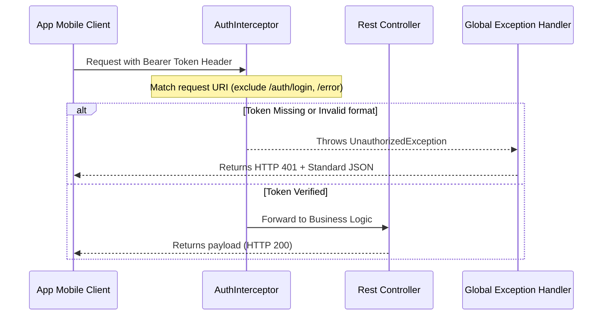
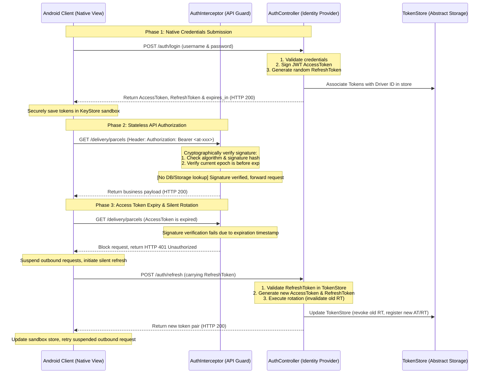

# EasyDelivery Backend API Design Document (English Version)

This document outlines the architecture, Maven module organization, and API endpoints for the EasyDelivery Spring Boot backend demo service.

## 1. Key Architectural Features

* **Language & Framework**: Java 17, Spring Boot 3.3.x
* **Modular Codebase**: Enforced isolation via Maven child modules to ensure seamless microservice extraction down the road.
* **In-Memory Store**: A thread-safe `MemoryDataStore` manages runtime simulation data (drivers, packages, scan batches, and reports) without needing external database software.
* **Standardized Responses**: Follows a consistent wrapper format containing `biz_code` (business error code), `biz_message` (description), and `biz_data` (data payload).

---

## 2. Maven Module Hierarchy

```
easydelivery-backend (Parent POM)
  ├── easydelivery-common    (DTOs, response wrappers, thread-safe memory store)
  ├── easydelivery-auth      (Credentials validation and session token issuance)
  ├── easydelivery-delivery  (Package queries and Proof-of-Delivery uploads)
  ├── easydelivery-scan      (Barcode scanning, batch reports, and reviews)
  └── easydelivery-app       (Spring Boot application bootstrap and configuration properties)
```

---

## 3. API Specifications

All endpoints are mapped relative to the base server path (e.g., `http://localhost:9000/`).

### A. Authentication Module (Auth Module)

#### 1. Driver Login
* **Path**: `POST /auth/login`
* **Request Header**: `Content-Type: application/json`
* **Request Body**:
  ```json
  {
    "credential_id": "driver123",
    "password": "password123"
  }
  ```
* **Response Body (Success)**:
  ```json
  {
    "biz_code": "COMMON.QUERY.SUCCESS",
    "biz_message": "Login Success",
    "biz_data": {
      "access_token": "mock-token-session-jwt-12345"
    }
  }
  ```

---

### B. Delivery Module (Delivery Module)

#### 1. Retrieve Delivering Package List
* **Path**: `GET /delivery/parcels/delivering?driver_id={driverId}`
* **Request Header**: `Authorization: Bearer <token>`
* **Response Body**:
  ```json
  {
    "biz_code": "COMMON.QUERY.SUCCESS",
    "biz_message": "Success",
    "biz_data": [
      {
        "order_id": 10001,
        "order_sn": "SN10001",
        "tracking_no": "BAUNI000300014438615",
        "goods_type": 1,
        "express_type": 1,
        "route_no": 12,
        "state": 2, 
        "name": "John Doe",
        "mobile": "1234567890",
        "address": "123 Main St, Vancouver, BC",
        "zipcode": "V6B 1A1",
        "lat": "49.2827",
        "lng": "-123.1207"
      }
    ]
  }
  ```

#### 2. Retrieve Unscanned Task List
* **Path**: `GET /delivery/parcels/tasks?criteria=UNSCANNED&driver_id={driverId}`
* **Request Header**: `Authorization: Bearer <token>`
* **Response Body**:
  *(Identical structure to Delivering List, filtered where `scan_status` is 0)*

#### 3. Upload Delivered POD
* **Path**: `POST /delivery`
* **Request Headers**: `Authorization: Bearer <token>`, `Content-Type: multipart/form-data`
* **Form Parameters**:
  * `order_id` (Text field)
  * `longitude` (Text field)
  * `latitude` (Text field)
  * `delivery_result` (Text field, `0` for Success, `1` for Failed)
  * `failed_reason` (Text field, optional error code if failed)
  * `recipient_name` (Text field, signature/recipient name, optional)
  * `pod_images[]` (File attachment part)
* **Response Body**:
  ```json
  {
    "biz_code": "COMMON.QUERY.SUCCESS",
    "biz_message": "Upload successful",
    "biz_data": null
  }
  ```

#### 4. Retry Delivery
* **Path**: `POST /delivery/retry`
* **Request Headers**: `Authorization: Bearer <token>`, `Content-Type: multipart/form-data`
* **Form Parameters**:
  * `order_id` (Text field)
  * `longitude` (Text field)
  * `latitude` (Text field)
  * `driver_id` (Text field)
  * `pod_img[]` (File attachment part)
* **Response Body**:
  ```json
  {
    "biz_code": "COMMON.QUERY.SUCCESS",
    "biz_message": "Retry recorded",
    "biz_data": null
  }
  ```

---

### C. Scan Module (Scan Module)

#### 1. Scan Package
* **Path**: `POST /delivery/ext/scan`
* **Request Headers**: `Authorization: Bearer <token>`, `Content-Type: application/json`
* **Request Body**:
  ```json
  {
    "tracking_no": "BAUNI000300014438615",
    "scan_batch_id": 99991
  }
  ```
* **Response Body**:
  ```json
  {
    "biz_code": "COMMON.QUERY.SUCCESS",
    "biz_message": "Success",
    "biz_data": {
      "orderId": 10001,
      "trackingNo": "BAUNI000300014438615",
      "routeNo": 12
    }
  }
  ```

#### 2. Create Scan Batch
* **Path**: `POST /delivery/scan/batch`
* **Request Headers**: `Authorization: Bearer <token>`, `Content-Type: application/json`
* **Request Body**:
  ```json
  {
    "driver_id": 101,
    "operator_role": 1,
    "scan_as": 2
  }
  ```
* **Response Body**:
  ```json
  {
    "biz_code": "COMMON.QUERY.SUCCESS",
    "biz_message": "Success",
    "biz_data": {
      "scan_batch_id": 99991
    }
  }
  ```

#### 3. Generate Scan Batch Report
* **Path**: `POST /delivery/scan/batch/report`
* **Request Headers**: `Authorization: Bearer <token>`, `Content-Type: application/json`
* **Request Body**:
  ```json
  {
    "scan_batch_id": 99991
  }
  ```
* **Response Body**:
  ```json
  {
    "biz_code": "COMMON.QUERY.SUCCESS",
    "biz_message": "Success",
    "biz_data": {
      "scan_time": "2026-06-27 20:51:00",
      "assigned_parcels_count": 10,
      "scanned_parcels_count": 8,
      "unscanned_parcels_count": 2,
      "unscanned_parcels": [
        {
          "tracking_no": "BAUNI000300014438699",
          "route_no": 12
        }
      ],
      "returned_parcels_count": 0,
      "returned_parcels": []
    }
  }
  ```

#### 4. Fetch Driver Report List
* **Path**: `GET /delivery/ext/scan/batch/reports?warehouse={warehouse}&driver_id={driverId}&start_date={startDate}`
* **Response Body**:
  ```json
  {
    "biz_code": "COMMON.QUERY.SUCCESS",
    "biz_message": "Success",
    "biz_data": [
      {
        "scan_batch_id": 99991,
        "name": "Batch_20260627",
        "dispatch_nos": "DISP001,DISP002",
        "driver_id": 101,
        "unscanned_parcels": 2,
        "scanned_parcels": 8,
        "returned_parcels": 0,
        "total_return_parcels": 0,
        "scan_time": "2026-06-27 20:51:00",
        "scan_batch_status": 1
      }
    ]
  }
  ```

#### 5. Submit Scan Batch Review
* **Path**: `PUT /delivery/ext/scan/batch/{scanBatchId}`
* **Request Headers**: `Authorization: Bearer <token>`, `Content-Type: application/json`
* **Request Body**:
  ```json
  {
    "status": "APPROVED"
  }
  ```
* **Response Body**:
  ```json
  {
    "biz_code": "COMMON.QUERY.SUCCESS",
    "biz_message": "Success",
    "biz_data": {
      "status": "APPROVED"
    }
  }
  ```

#### 6. Fetch "To Be Picked Up" Brief
* **Path**: `GET /delivery/to-be-picked-up/brief/{driverId}`
* **Request Header**: `Authorization: Bearer <token>`
* **Response Body**:
  ```json
  {
    "biz_code": "COMMON.QUERY.SUCCESS",
    "biz_message": "Success",
    "biz_data": {
      "total_number": 15,
      "address": "Warehouse Sector 4B",
      "scan_batch_id": 99991,
      "scan_batch_status": 1,
      "scanned_item_quantity": 8
    }
  }
}
```

---

## 4. Detailed Security, Robustness, and Fault Tolerance Design

### A. Token Authentication Mechanics (API Route Security)

The security verification flow is built using a global **Spring WebMvc Interceptor** combined with a **Unified Rest Controller Advice**.



#### 1. Interceptor Lifecycle Hook
*   **Implementation Class**: [AuthInterceptor.java](file:///Users/whitetang/Desktop/Code/easydelivery_backend/easydelivery-common/src/main/java/com/hf/easydelivery/common/interceptor/AuthInterceptor.java) implements `org.springframework.web.servlet.HandlerInterceptor`.
*   **Lifecycle Stage**: Intercepts requests by overriding `preHandle(request, response, handler)` before the dispatcher routes the incoming request to the targeted Controller class.
*   **Request URI Filtering**: Hardcoded exclusions check if `request.getRequestURI()` matches `/auth/login` or `/error`, returning `true` immediately to skip validation.

#### 2. Case-Insensitive Header Extraction
To prevent compatibility problems caused by various HTTP clients (e.g. Volley on Android rewriting request headers to lowercase), header checking resolves defensively:
1. Try parsing standard header: `String authHeader = request.getHeader("Authorization");`
2. Fallback to lowercase header: `authHeader = request.getHeader("authorization");`
3. Validate presence and prefix formatting: `authHeader != null && authHeader.startsWith("Bearer ")`.
4. Parse Token value using string slicing: `String token = authHeader.substring(7)`.

#### 3. Authentication Failures and HTTP 401 Response
*   The token is verified against simulated sessions in `MemoryDataStore` (configured to validate `"mock-token-session-jwt-12345"`).
*   If validation fails, an `UnauthorizedException` is thrown. This is caught globally by [GlobalExceptionHandler.java](file:///Users/whitetang/Desktop/Code/easydelivery_backend/easydelivery-common/src/main/java/com/hf/easydelivery/common/exception/GlobalExceptionHandler.java):
    ```java
    @ExceptionHandler(UnauthorizedException.class)
    @ResponseStatus(HttpStatus.UNAUTHORIZED) // HTTP 401
    public AppResponse<Void> handleUnauthorizedException(UnauthorizedException ex) {
        return AppResponse.fail("AUTH.UNAUTHORIZED", ex.getMessage());
    }
    ```
*   This ensures the mobile app receives a standard HTTP 401 status with the standard response body:
    ```json
    {
      "biz_code": "AUTH.UNAUTHORIZED",
      "biz_message": "Session has expired or token is invalid",
      "biz_data": null
    }
    ```

---

### B. Interface Idempotency Design

Due to unstable mobile networks, the Android client's sync queue (`PendingPackagesMgr`) will retry uploading completed deliveries if it fails to receive an HTTP success response. The backend implements **strict idempotency guards** on state-changing endpoints to handle this scenario.

#### 1. POD Upload Idempotency (`POST /delivery`)
The logic flow for handling multi-part POD uploads is illustrated below:

```
                    +------------------------+
                    |  POST /delivery Request|
                    +-----------+------------+
                                |
                                v
                   +------------+------------+
                   |  Search for order_id   |
                   |  in MemoryDataStore     |
                   +------------+------------+
                                |
                                v
                  /-------------+-------------\
                 /                             \
                <  Is parcel state == 3         >
                 \   (Delivered/Completed)?    /
                  \-------------+-------------/
                                |
                      YES       |          NO
             +------------------+------------------+
             |                                     |
             v                                     v
    +--------+-------+                    +--------+-------+
    | Idempotency:   |                    | Perform Update: |
    | Log warning,   |                    | 1. Set state = 3|
    | Skip DB/Files  |                    | 2. Store POD image|
    | to avoid dupes |                    +--------+-------+
    +--------+-------+                             |
             |                                     |
             +------------------+------------------+
                                |
                                v
                    +-----------+------------+
                    | Return Success (HTTP 200)|
                    +------------------------+
```

*   **Idempotency Steps**:
    When the client invokes `POST /delivery`, the controller does the following:
    1. Fetch parcel entity: `DeliveringListData p = dataStore.getParcelByOrderId(orderId);`
    2. Check state: If `p.getState() == 3` (Delivered), it detects a duplicate request. It logs an idempotency warning, skips file writing, and immediately returns HTTP 200.
    3. If the state is not 3, it sets `state = 3` and persists the files.
    4. In both cases, the client receives a **success response (HTTP 200)**, enabling the mobile app to mark the task as synchronized.

#### 2. Delivery Retry Idempotency (`POST /delivery/retry`)
*   Similarly, for `POST /delivery/retry`, if the package is already in retrying state (`state == 2` and `scan_status == 1`), the server returns success directly to prevent concurrent modification errors.

---

### C. Data Integrity & Scanning Collision Protection

In multi-driver warehouse scenarios, two drivers might scan the same package. The backend protects scanning status with a **concurrency lock**:

1. **State Check**:
   During `POST /delivery/ext/scan`, the controller retrieves the parcel:
   ```java
   DeliveringListData parcel = dataStore.getParcelByTrackingNo(req.getTracking_no());
   ```
2. **Scan status check**:
   If `parcel.getScan_status() == 1` (already scanned), the scan request is rejected.
3. **Graceful Business Error Response**:
   Instead of crashing, the server throws a `BizException` mapping to `SCAN.ALREADY.SCANNED` at HTTP 200, allowing the app to show a clear warning message: "*This parcel has already been scanned by another driver.*"

---

### D. File Upload Path Traversal Protection

To prevent path traversal exploits (e.g. uploading a file named `../../etc/passwd` to overwrite system files):

*   **FileName Sanitization**:
    We sanitize the file's original name using Java's standard NIO paths library:
    ```java
    String rawFileName = file.getOriginalFilename();
    if (rawFileName != null) {
        // Strip path directories, retaining only the basename
        String safeFileName = java.nio.file.Paths.get(rawFileName).getFileName().toString();
        // Generate a random UUID prefix to store it safely
        String diskFileName = java.util.UUID.randomUUID().toString() + "_" + safeFileName;
    }
    ```

---

## 5. First-Party App Dual-Token and JWT Stateless Verification Design

Since the EasyDelivery App and its API endpoints are first-party products under unified ownership, the system bypasses complex browser redirection flows (preventing abrupt user-experience jumps). It relies instead on **Native Credentials Login + Asymmetric/Symmetric JWT Stateless Signature Verification**.

### A. Dual-Token and Stateless Verification Concepts

The security trust-chain is maintained cryptographically:

*   **Access Token (JWT-Based Stateless Verification)**:
    *   **Lifespan**: Short (e.g. 2 hours).
    *   **Verification**: **Stateless Verification**.
    *   **Mechanism**: The gateway or microservices decrypt/re-hash the token header and payload using the configured key (via HS256 / RS256 algorithms) and verify it against the signature string at the tail of the token. No database or key-value store reads are performed, keeping API endpoints fast.
    *   **Claims Payload**:
        ```json
        {
          "sub": "driver123",        // Subject driver ID
          "iat": 1719540000,         // Issued-at epoch timestamp
          "exp": 1719547200,         // Expiration epoch timestamp
          "jti": "uuid-access-001"   // Unique Token ID
        }
        ```
*   **Refresh Token (Stateful Storage)**:
    *   **Lifespan**: Long (e.g. 30 days).
    *   **Verification**: **Stateful Verification**.
    *   **Mechanism**: To guarantee the ability to revoke user sessions, refresh tokens are registered within a stateful `TokenStore`. When the access token expires, the client calls `/auth/refresh` carrying this token, which is verified against the store by the server.

#### A.1. Stateless Access vs. Stateful Refresh Token Design Rationale

Designing the validation model as a hybrid (stateless Access Tokens + stateful Refresh Tokens) represents the industry standard for balancing high-throughput performance with robust session control:

1. **Access Token - Cryptographically Stateless (High Performance)**:
   * **Design**: Access Tokens are **never stored on the backend database or cache**.
   * **Reasoning**: Mobile clients make high-frequency requests to business endpoints (fetching packages, scanning, uploading PODs). Querying a session table on every request creates an operational bottleneck. Relying on digital signatures (e.g. HMAC-SHA256) enables gateways and microservices to verify authenticity, integrity, and expiration locally in memory with zero network or disk overhead.
2. **Refresh Token - Stored inside TokenStore (Security Control & Revocation)**:
   * **Design**: Refresh Tokens **must be registered and tracked in the stateful `TokenStore`**.
   * **Reasoning**:
     * *Immediate Session Revocation*: If a user changes their password, locks their account, or loses their mobile device, stateless validation alone cannot invalidate active sessions. Retaining Refresh Tokens in the `TokenStore` enables the backend to instantly delete the session mapping, preventing unauthorized clients from generating new Access Tokens.
     * *Enforcing Refresh Token Rotation*: To protect against token-theft replays, old Refresh Tokens must be invalidated as soon as they are used. This rotation check requires the server to record token lifecycle states.

#### A.2. User Management & Secure Storage Design

Because delivery driver accounts are provisioned via administrative channels or HR identity synchronization, we implement a decoupled user management framework with strong security safeguards:

1. **User Registration & Database-Ready Abstraction (`DriverRepository`)**:
   * **API Endpoint**: `POST /auth/register` is exposed for admin/developer provisioning, accepting `credential_id` (username), `password`, and `name`.
   * **Storage Abstraction**: The core business logic interacts only with the `DriverRepository` interface. The system defaults to `InMemoryDriverRepository` (storing accounts in concurrent memory collections). For production deployment, switching to relational database storage (MySQL/PostgreSQL) is a drop-in replacement by creating a database-backed implementation of this interface (via JPA/MyBatis) with zero changes to controllers or business logic.
2. **Standard Cryptographic Password Hashing (BCrypt Hashing)**:
   * **Design Constraint**: To protect driver accounts in the event of database leaks, passwords **must never be stored as plain-text**.
   * **Implementation**: We utilize Spring Security's `BCrypt` library to apply salted hashing on passwords during registration (`BCrypt.hashpw(raw, gensalt())`). Password checks during login are verified cryptographically via `BCrypt.checkpw(raw, hashed)`. This mitigates brute-force attacks and rainbow table lookups.
3. **Driver Account Lifecycle Status Control (Status Control)**:
   * **Design**: The `Driver` entity includes a `status` field (e.g. `ACTIVE`, `SUSPENDED`).
   * **Runtime Logic**:
     * **Block on Login**: The login endpoint `POST /auth/login` checks `driver.isActive()` and blocks authentication if the account is suspended.
     * **Block on Refresh**: If a driver's status is changed to suspended while they have active sessions, their token will expire within 2 hours. When the client calls `/auth/refresh`, the server verifies their active status and blocks token reissue.
     * **Immediate Revocation**: For compromised sessions, dispatchers can invoke `TokenStore.revokeTokens` to instantly blacklist active Access Tokens, ensuring immediate lockout.

---

### B. Login & Silent Refresh Sequence (First-Party App Flow)



---

### C. Endpoint Payload Specifications

#### 1. Credentials Authentication (`POST /auth/login`)
*   **Action**:
    1. Authenticate user.
    2. Generate JWT Access Token signed with HS256 secret key configured inside the server's `application.properties`.
    3. Generate cryptographically random Refresh Token hash and map it in the `TokenStore`.
*   **Response Body**:
    ```json
    {
      "biz_code": "COMMON.QUERY.SUCCESS",
      "biz_message": "Success",
      "biz_data": {
        "token_type": "Bearer",
        "access_token": "eyJhbGciOiJIUzI1NiIsInR5cCI6IkpXVCJ9.eyJzdWIiOiJkcml2ZXIxMjMiLCJleHAiOjE3MTk1NDcyMDB9...",
        "refresh_token": "rt_8f3d9a2c1b0e7f6d5c4b3a2",
        "expires_in": 7200
      }
    }
    ```

#### 2. Token Refresh (`POST /auth/refresh`)
*   **Action**:
    1. Extract `refresh_token` from JSON payload.
    2. Validate token presence inside `TokenStore`.
    3. Execute **Refresh Token Rotation**: revoke current refresh token, invalidate access token, generate a fresh token pair, and register it.

#### 3. Token Revocation (`POST /auth/logout`)
*   **Action**:
    1. Extract active `access_token` from authorization header.
    2. Call `TokenStore.revokeTokens(accessToken)` to evict refresh tokens and terminate session refresh capabilities.

---

### D. Client-Side Security Best Practices

1.  **Sandbox Storage**:
    *   **Android**: Utilize **`EncryptedSharedPreferences`** which leverages Android KeyStore symmetrically to encrypt storage with AES-GCM-256.
    *   **iOS**: Persist tokens directly in **`iOS Keychain`** services.
2.  **Transport Encryption**:
    *   Enforce **TLS 1.3** communication channel to eliminate local packet-sniffing exploits.


