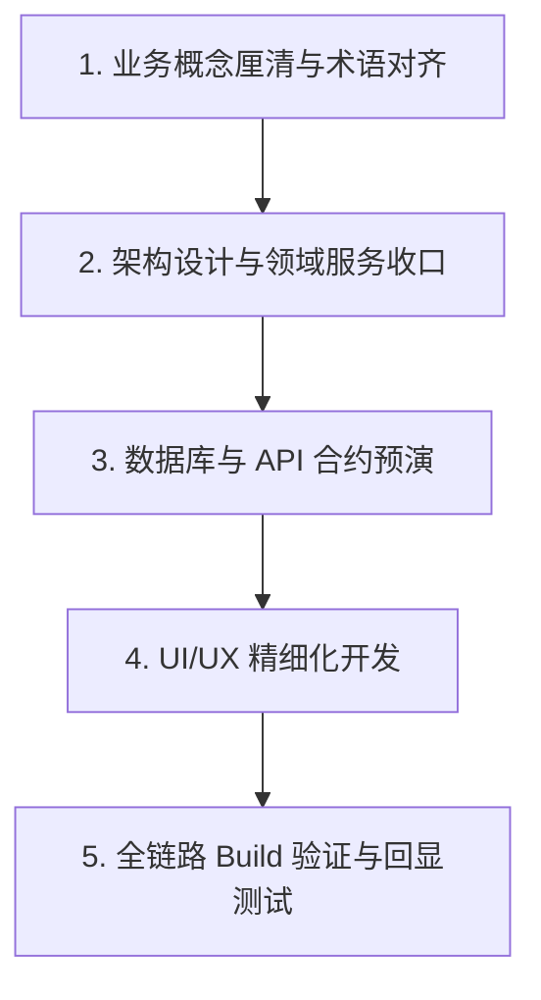

# Agent 驱动软件开发方法论与架构约束指南 (Agent-Driven Software Engineering Guidelines)

> **版本**: v1.0.0  
> **适用场景**: 基于 EasyDelivery 实践沉淀，适用于所有 AI Agent / Human 混合协同开发的中大型复杂软件系统项目。

---

## 目录

1. [核心开发哲学与基本原则](#1-核心开发哲学与基本原则)
2. [领域驱动设计 (DDD) 与数据治理模式](#2-领域驱动设计-ddd-与数据治理模式)
3. [UI/UX 与前端工程规范](#3-uiux-与前端工程规范)
4. [文档与 PRD 治理规范](#4-文档与-prd-治理规范)
5. [Agent 协作流程与标准工作流 (Standard Workflow)](#5-agent-协作流程与标准工作流-standard-workflow)
6. [质量保障与代码防腐机制](#6-质量保障与代码防腐机制)

---

## 1. 核心开发哲学与基本原则

### 1.1 业务第一，拒绝非业务信息 (Operational-Centric)
* **原则**：面向实际业务运营的系统，UI/UX 中**严禁引入任何促销、宣传、无关说明或业务无关的占位文字**。
* **要求**：所有界面元素必须直接服务于运营人员的“决策”与“执行”。

### 1.2 单一事实源与数据防腐 (Single Source of Truth)
* **原则**：任何业务状态或数据关联在系统中必须有且仅有一个**权威事实源 (Single Source of Truth)**，禁止创建无意义的冗余数据副本。
* **要求**： downstream 模块严禁随意复制或手写维护上游状态，必须通过动态 JOIN 查询或不可变视图 DTO 获取。

---

## 2. 领域驱动设计 (DDD) 与数据治理模式

### 2.1 充血领域服务 (Domain Service) 强封装模式
为了防止多模块手写 SQL 修改关联关系导致“数据更新遗漏”与“脏数据残留”，系统必须严格遵循以下规则：

```text
               ┌────────────────────────────────────────────────────────┐
               │              外部业务调用方 (Callers)                   │
               │  [到货交接模块]    [扫描对账模块]    [司机派送 Task]     │
               └───────────────────────┬────────────────────────────────┘
                                       │ 🚫 严禁直接手写 SQL / 修改底库
                                       ▼ 只能通过领域服务统一接口调用
               ┌────────────────────────────────────────────────────────┐
               │              领域服务/聚合根 (Domain Service)           │
               ├────────────────────────────────────────────────────────┤
               │  • reassignEntity(...) ➔ 原子化完成解绑旧数据/绑定新数据 │
               │  • queryEntityView(...)➔ 统一只读视图透出              │
               └───────────────────────┬────────────────────────────────┘
                                       │ 🔐 唯一管控数据库底层细节
                                       ▼
                       ┌───────────────────────────────┐
                       │          数据库 (Database)     │
                       └───────────────────────────────┘
```

#### 🛠️ 强制开发约束：
1. **隐藏 SQL 细节**：除了聚合根对应的专属 `DomainService` 外，**严禁任何外部 Service/Controller 直接手写 Native SQL 操作跨领域主表与关联表**。
2. **修改原子覆写 (Atomic Overwrite)**：当发生关系变更（如 A 对象切到 B 对象）时，`DomainService` 内部必须执行**“先清理旧关联 ➔ 再建立新关联”**的原子事务，彻底消除废弃冗余数据。
3. **隔离模板与物理实例 (Template vs Instance Isolation)**：
   - **常态模板 (Template Rule)**：保存通用逻辑规则（如 `站点 + 区域 ➔ 默认板笼代号`），实现每日配置的自动继承复用，免去人工重复配置；
   - **物理实例 (Physical Instance)**：每次批次生成时，自动派生具备**唯一独立主键 ID** 的物理实例（如 `trip_id=501` 下的 `handling_unit_id=10086`），确保车次/批次间数据强隔离、绝对不混淆。

---

## 3. 高高级系统设计模式 (System Design Patterns)

为了保证大体量物流业务演进过程中系统不卡顿、代码不腐化，系统设计必须采纳以下模式：

### 3.1 读写分离与 Command/Query 职责解耦
* **写侧 (Command Side / Mutations)**：
  - 必须通过 Spring Data JPA 或 `DomainService` 进行实体生命周期与强一致控制，使用悲观锁 `@Lock(PESSIMISTIC_WRITE)` 或乐观锁 `@Version` 解决多并发抢单/核销冲突。
* **读侧 (Query Side / Projections)**：
  - 高频统计、大表格分页与地图渲染**严禁使用 JPA 对象导航与全表内存装载**。
  - 必须使用 `JdbcTemplate` 或原生 SQL Projection 批量高效率查询，避开 ORM N+1 查询性能陷阱。

### 3.2 悲观锁与并发控制 (Locking & Concurrency)
* 在涉及到核心库存、包裹归派、司机容量扣减等高并发场景下，必须在数据库层对关联的主实体（如 `arrival_trip`，`driver_shift`）加锁：
  ```sql
  SELECT ... FROM arrival_trip WHERE id = ? FOR UPDATE
  ```

---

## 4. 极致性能与高并发优化规范 (Performance & Scalability)

大体量物流数据（如百万级包裹 `parcel`、巨量板笼明细 `handling_unit_parcel`）下，性能优化遵循以下法则：

### 4.1 数据库与索引优化 (Database Indexing)
1. **复合索引法则 (Composite Indexes)**：
   - 所有关联表必须针对高频查询组合建立复合索引。例如 `handling_unit_parcel` 必须建立 `(handling_unit_id, parcel_id)` 与 `(parcel_id, link_source)` 联合索引。
2. **避免深度分页大 SQL**：
   - 避免无索引的 `OFFSET` 分页；前端必须提供分页限制（如后端默认 `pageSize: 20/50`，前端设置 `pageSize: 6`）。

### 4.2 数据归档与生命周期隔离 (Data Archiving)
1. **活跃表与历史表分离**：
   - `handling_unit_parcel` 只保留当前处于未派送/履约中（如 30 天内）的活跃关联记录；
   - 订单完成或归档后，定时任务自动转移至历史归档表（`handling_unit_parcel_history`），确保活跃表数据量始终保持在百万级极速查询范围内。

### 4.3 前端渲染与网络性能 (Frontend Performance)
1. **按需按阶渲染 (Lazy & Conditional Rendering)**：
   - 地图组件 (Leaflet/Mapbox) 与高密度 GeoJSON 图层**仅在视觉可见阶段（Step 3/4）按需加载**，不在 Step 1/2 无谓渲染。
2. **批量请求与防抖 (Debounce & Batch API)**：
   - 表格指派/批量操作必须使用 Batch API（如 `areaVersionIds: [...]` 数组），严禁在循环中向后端发起 N 次单独 HTTP 请求。


### 3.1 术语与 i18n 绝对统一 (Term Standardization)
* **要求**：同一物理业务实体在全局所有菜单、页面、弹窗及 i18n 语言包中**必须使用完全统一的中文/英文术语**。
* **反面教材**：同一实体在 A 页面叫“到仓批次”，在 B 页面叫“干线车次”，在 C 页面叫“到货批次” ➔ **坚决杜绝！**

### 3.2 场景化响应式与容器宽度控制
* **非地图场景 (纯表单/矩阵)**：当隐藏地图或进行纯数据配置时，**严禁将表单/表格简单设为 100% 拉伸**（会导致宽屏下极其难看）。必须使用精致的 `maxWidth` 容器（如 `640px` 居中表单，`960px` 居中表格），保证最舒适的阅读与操作列宽。
* **地图场景 (空间决策)**：仅在需要空间排线、套索多选等地理决策阶段（Step 3/4）才亮出地图，其他配置阶段（Step 1/2）自动隐藏地图，提升性能与视觉焦点。

### 3.3 状态可清空与高亮回显 (Clearable & Resilient Hydration)
* **要求**：所有选择器/下拉框必须支持 `allowClear`（清空）和自由修改；回显计算逻辑必须具备保底降级机制（即使无关联包裹，也能凭模板/本地状态稳固高亮回显，绝不消失）。

---

## 4. 软件生命周期全流程规范 (Lifecycle Pipeline)

```mermaid
flowchart LR
    A[Requirement PRD] --> B[Iteration Spec (REVIEWED)]
    B --> C[Schema Flyway Migration]
    C --> D[Domain Code & Unit Test]
    D --> E[Full Reactor Build & Verification]
    E --> F[PR & Iteration Summary]
```

### 4.1 需求与迭代双层治理模式 (Two-Level Governance)
为了避免 Agent 在长周期开发中偏离方向，项目文档遵循严格的“两级架构”：

1. **第一级：系统长效基线 (PRD Baseline)** (`docs/prd/*.md`)
   - 记录系统的全局架构、用户角色权限、核心数据流与页面设计规范。
   - 当新增或改变系统基本产品能力时，**必须首先更新 PRD Baseline**。
2. **第二级：短期迭代规格 (Iteration Spec)** (`docs/<domain>/iterations/iteration-*.md`)
   - 记录短期 Sprint 的需求范围、API Delta、契约变更与 DoD（完成定义）。
   - **状态流转**：写代码前必须标记为 `REVIEWED`，上线交付后填写 `Summary` 总结。

---

## 5. 自动化测试与质量保障体系 (Testing Strategy)

为确保 AI Agent 生成的代码具备工业级稳健性，必须建立**“分层测试 + 自动化预检”**机制：

### 5.1 单元测试与集成测试矩阵 (Unit & Integration Tests)
1. **测试命名与位置**：
   - 测试类必须命名为 `*Test.java`，位于 `src/test/java` 目录下，并与被测生产类保持完全相同的 Package 包路径。
2. **行为驱动命名 (Behavior-Focused Naming)**：
   - 测试方法名必须直接描述期望行为（如 `returnsTokenForValidCredentials`，`shouldClearOldUnitAssociationWhenReassigned`）。
3. **关键覆盖路径**：
   - **必须覆盖 4 类场景**：主成功路径 (Happy Path)、业务校验拦截 (Validation)、鉴权与权限 (Auth)、异常失败退路 (Failure Fallback)。
   - **关系变更专项测试**：每次调整领域服务时，必须编写“旧关联清理 + 新关联写入”的断言测试，确保数据无残留。

### 5.2 契约与 E2E 自动化断言
1. **Flyway 数据库演进断言**：
   - 任何数据库 Schema 改动必须通过独立 Flyway 迁移脚本（`V<N>__*.sql`）。
   - 提交前必须执行原生 MySQL 集成测试（`DB_PASSWORD='<secret>' scripts/mysql-e2e-test.sh`），保证 Flyway 干净平滑迁移。
2. **全 Reactor 打包校验 (Strict Maven Gate)**：
   - 代码提交前的终极校验命令：`./tools/apache-maven-3.9.8/bin/mvn clean verify` 或 `./run.sh test` + `npm run build`。必须达到 **Zero Warning / Zero Compilation Error**。

---

## 6. Agent 研发标准化工作流 (Agent Workflow Pipeline)

当 Agent 接收到复杂需求时，必须严格按照以下 **5 阶段工作流** 执行：



1. **业务概念厘清与术语对齐 (Discovery & Alignment)**：
   - 弄清底层业务实体的物理语义（如 `Trip No` vs `Wave Code`），向用户解释清晰，并统一 i18n 词汇。
2. **架构设计与领域服务收口 (Architecture & Encapsulation)**：
   - 检查是否有跨模块手写 SQL 或逻辑散落问题，统一收口至 `DomainService`。
3. **数据库与 API 合约预演 (Data Migration & Persistence)**：
   - 使用 Flyway 进行 Schema 变更，保证数据变更有迹可循；设计带 `link_source` 等溯源标记的关系表。
4. **UI/UX 精细化开发 (Frontend Refinement)**：
   - 检查容器拉伸、硬编码文案、下拉框修改/清空解绑逻辑，确保无假提示（Mock Message）。
5. **全链路 Build 验证 (Build & Verification)**：
   - 必须通过 `npm run build` 和 `./run.sh test` 验证，确保零 TypeScript / Compilation 错误。

---

## 7. 质量防腐与代码提交约束 (Anti-Corrupt Rules)

1. **拒绝假提示与 Mock 代码**：
   - 提示框（Toast / Message）必须真实反映后端接口执行结果，严禁保留原型阶段的伪算法提示（如“采用轮询均衡算法”）。
2. **硬编码清理**：
   - 全面搜索并清理前端下拉框、输入框中的硬编码测试占位符（如 `TRIP-20260724-YHZ`），确保全部动态读取真实 API。
3. **Commit 提交规范**：
   - 使用祈使句简短提交（如 `scan: validate batch status`），明确标注影响模块（如 `driver`, `operations`, `common`）。

