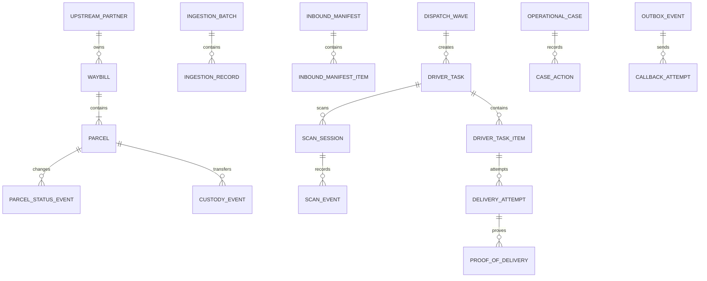

# MySQL Data Model, Field Dictionary, and Capacity Design

## 1. Baseline

The current production baseline is Flyway `V1__baseline_schema.sql`: MySQL 8, InnoDB, `utf8mb4_0900_ai_ci`, UTC `DATETIME(3)`, and `BIGINT UNSIGNED AUTO_INCREMENT` business keys. This document covers all **24 current business tables**. MOV additions use new migrations; V1 is immutable.

Common fields: `id` internal key; `version` optimistic-lock counter; `created_at/updated_at` creation and last-update time. JSON is limited to protocol snapshots and extension metadata, never a substitute for queryable constrained facts.

## 2. Relationships

## 3. Master Data and Identity

### `upstream_partner`

**Use:** integration ownership/routing root. Fields: `id` partner ID; `partner_code` stable unique URL/config code; `partner_name` display name; `integration_mode` `PUSH/PULL/FILE/HYBRID`; `status` `ACTIVE/SUSPENDED/DISABLED`; `timezone` IANA timezone; `config_json` non-secret callback/mapping policy; `version` concurrency; `created_at/updated_at` lifecycle timestamps. Never store plaintext secrets in JSON.

### `station`

**Use:** inventory, operations, and authorization boundary. Fields: `id`; `station_code` unique external code; `station_name`; `timezone` IANA business-day zone; `address_line`; `status` `ACTIVE/SUSPENDED/CLOSED`; `version`; `created_at/updated_at`.

### `driver`

**Use:** driver account and home station. Fields: `id` and JWT subject; `home_station_id` nullable station FK; `credential_id` unique login; `password_hash` BCrypt; `driver_name`; `phone` sensitive contact; `status` `ACTIVE/SUSPENDED/INACTIVE`; `version`; `created_at/updated_at`. `(home_station_id,status)` serves active-station lookup.

### `auth_session`

**Use:** refresh, revocation, and session audit. Fields: `id`; `driver_id` FK; unique `access_token_hash/refresh_token_hash` SHA-256; `access_expires_at/refresh_expires_at`; nullable `revoked_at`; `created_at/updated_at`. `(driver_id,revoked_at)` finds active sessions.

## 4. Ingestion and Shipment

### `ingestion_batch`

**Use:** one push, pull page, or file result. Fields: `id`; `partner_id`; nullable partner-scoped `external_batch_no`; `source_type` `PUSH/PULL/FILE`; `status` `RECEIVED/PROCESSING/PARTIAL/COMPLETED/FAILED`; `received_count/accepted_count/rejected_count`; `started_at/completed_at`; `created_at/updated_at`.

### `ingestion_record`

**Use:** immutable-ish raw item, idempotent result, and replay evidence. Fields: `id`; `batch_id`; `partner_id`; partner-unique `external_event_id`; nullable `external_waybill_no`; sensitive `payload_json`; `payload_sha256` for same-key/different-body detection; `status` `RECEIVED/ACCEPTED/REJECTED/QUARANTINED`; `error_code/error_message`; `processed_at`; `created_at`.

### `waybill`

**Use:** upstream commercial shipment and recipient/service data. Fields: `id`; `partner_id`; partner-unique `external_waybill_no`; `external_version`; `shipper_name`; sensitive `recipient_name/recipient_phone`; `address_line1/address_line2`; `city/province/postal_code/country_code`; `service_code`; `delivery_window_start` / `delivery_window_end` with start before end; `status` `ACTIVE/ON_HOLD/CANCELLED/COMPLETED`; `source_event_time`; `version`; `created_at/updated_at`.

### `parcel`

**Use:** current physical-piece projection. Fields: `id`; `waybill_id`; globally unique `tracking_no`; `piece_no/piece_count`; `current_station_id`; lifecycle `status`; `current_custody_type` `UPSTREAM/STATION/DRIVER/RETURN_CARRIER/UNKNOWN`; polymorphic `current_custody_id`; `current_location_code`; `route_code`; `promised_date`; `version`; `created_at/updated_at`. `(station,status,updated_at)` serves inventory; `(route,date)` serves dispatch. Current projections change only with immutable events.

### `parcel_status_event`

**Use:** append-only lifecycle timeline and callback source. Fields: `id`; `parcel_id`; strictly increasing `sequence_no`; `from_status/to_status`; `event_type`; `reason_code`; parcel-scoped `idempotency_key`; `actor_type/actor_id`; `metadata_json`; business `occurred_at`; server `created_at`.

### `custody_event`

**Use:** append-only physical responsibility chain. Fields: `id`; `parcel_id`; `from_type/from_id`; `to_type/to_id`; `reason_code`; evidence `reference_type/reference_id`; `actor_id`; `occurred_at/created_at`.

## 5. Inbound, Dispatch, and Scanning

### `inbound_manifest`

**Use:** upstream arrival pre-advice and batch close. Fields: `id`; `partner_id/station_id`; partner-unique `external_manifest_no`; `expected_arrival_at/actual_arrival_at`; `status` `EXPECTED/RECEIVING/DISCREPANCY/CLOSED/CANCELLED`; projected `expected_count/received_count/discrepancy_count`; `closed_by/closed_at`; `version`; `created_at/updated_at`.

### `inbound_manifest_item`

**Use:** piece-level expected/received comparison. Fields: `id`; `manifest_id`; nullable matched `parcel_id`; `expected_tracking_no`; `receipt_status` `EXPECTED/RECEIVED/MISSING/EXTRA/WRONG_STATION/DAMAGED`; `received_at/received_by`; `discrepancy_reason`; `created_at/updated_at`.

### `dispatch_wave`

**Use:** station/date/route plan container. Fields: `id`; `station_id`; station-unique `wave_code`; `service_date`; `route_code`; `status` `DRAFT/PUBLISHED/IN_PROGRESS/CLOSED/CANCELLED`; `published_at/published_by`; `version`; `created_at/updated_at`.

### `driver_task`

**Use:** one driver's wave work. Fields: `id`; `wave_id/driver_id/station_id`; globally unique `task_code`; `service_date`; `status` `DRAFT/PUBLISHED/ACCEPTING/IN_PROGRESS/CLOSED/CANCELLED`; `accepted_at/started_at/closed_at`; `version`; `created_at/updated_at`. `(driver,status,date)` is the main App lookup.

### `driver_task_item`

**Use:** task-parcel assignment/execution. Fields: `id`; `task_id/parcel_id`; optional `stop_sequence`; `item_status` `ASSIGNED/LOADED/OUT_FOR_DELIVERY/DELIVERED/FAILED/RETURNED/REASSIGNED/CANCELLED`; generated `active_slot` 1 for active states, otherwise NULL; `created_at/updated_at`. Unique `(parcel_id,active_slot)` prevents two active assignments using MySQL multi-NULL semantics.

### `scan_session`

**Use:** LOAD/RETURN/TRANSFER scan and approval. Fields: `id`; `task_id/driver_id`; `session_type`; `status` `OPEN/SUBMITTED/APPROVED/REJECTED`; `expected_count/scanned_count/discrepancy_count`; `opened_at/submitted_at`; `reviewed_by/reviewed_at`; `version`.

### `scan_event`

**Use:** append-only device scan. Fields: `id`; `session_id`; nullable matched `parcel_id`; raw `tracking_no`; globally unique `device_event_id`; `result_code` `EXPECTED/EXTRA/DUPLICATE/WRONG_TASK/UNKNOWN`; `latitude/longitude`; device `scanned_at`; server `created_at`.

## 6. Delivery, Exception, Callback, and Closeout

### `delivery_attempt`

**Use:** one delivered/failed visit. Fields: `id`; `task_item_id/parcel_id/driver_id`; parcel-increasing `attempt_no`; `outcome` `DELIVERED/FAILED`; required-on-failure `failure_reason_code`; sensitive `recipient_name`; `latitude/longitude`; driver-scoped `idempotency_key`; `attempted_at/created_at`.

### `proof_of_delivery`

**Use:** evidence metadata, never binary storage. Fields: `id`; `attempt_id`; `pod_type` `PHOTO/SIGNATURE/OTP/RECIPIENT/GEOLOCATION`; private `object_uri`; `content_sha256`; `content_type/content_size`; `captured_at`; `metadata_json`; `created_at`.

### `operational_case`

**Use:** owned, SLA-controlled exception. Fields: `id`; unique `case_no`; `case_type`; optional `parcel_id/station_id`; `priority` `LOW/NORMAL/HIGH/CRITICAL`; `status` `OPEN/ASSIGNED/WAITING_EXTERNAL/RESOLVED/CLOSED`; `owner_type/owner_id`; `sla_due_at`; `resolution_code/resolution_note`; `version`; `created_at/updated_at/resolved_at/closed_at`.

### `case_action`

**Use:** append-only case history. Fields: `id`; `case_id`; `action_type`; `from_status/to_status`; `actor_type/actor_id`; redacted `note`; `metadata_json`; `created_at`.

### `outbox_event`

**Use:** transactionally captured event awaiting reliable publication. Fields: `id`; `aggregate_type/aggregate_id`; `event_type`; globally stable `event_key`; optional `partner_id`; versioned `payload_json`; `status` `PENDING/PROCESSING/RETRY/ACKNOWLEDGED/DEAD_LETTER`; `attempt_count/next_attempt_at`; lease `locked_at/locked_by`; `acknowledged_at`; `last_error`; `created_at/updated_at`.

### `callback_attempt`

**Use:** evidence of each external call. Fields: `id`; `outbox_event_id`; `attempt_no`; redacted `request_url`; `request_sha256`; `response_status`; truncated/redacted `response_body_excerpt`; `outcome` `ACKNOWLEDGED/RETRYABLE_FAILURE/PERMANENT_FAILURE`; `error_message`; `started_at/completed_at/created_at`.

### `daily_reconciliation`

**Use:** station/business-date balance and sign-off. Fields: `id`; `station_id`; `business_date` (unique together); `opening_count`; `inbound_count/transfer_in_count`; `dispatched_count`; `driver_return_count`; `delivered_count`; `transfer_out_count/upstream_return_count`; `expected_closing_count`; `actual_closing_count`; `variance_count`; `open_case_count`; `status` `OPEN/REVIEW_REQUIRED/SIGNED_OFF`; `carryover_reason`; `signed_off_by/signed_off_at`; `created_at/updated_at`.

## 7. Query and Join Rules

Start online queries with selective partner/station/driver plus status and use keyset pagination. Principal paths are driver task `(driver,status,date)`, station inventory `(station,status,updated_at,id)`, manifest `(station,status,arrival)`, case `(status,owner,sla)`, due Outbox `(status,next_attempt_at,id)`, and parcel timeline `(parcel_id,time/sequence)`. Merge separate timelines in the service; never run unbounded unions.

Every new query requires `EXPLAIN ANALYZE` at realistic volume. No `SELECT *`, unbounded lists, deep offset pagination, or N+1. Long-running operational reporting moves to daily summaries/read replica/analytics rather than scanning transactional event tables.

## 8. Capacity, History, and Archive

Model volume as `daily parcels × events per parcel × retention days`. Pilot establishes the baseline. Consider monthly time partitioning only when evidence warrants it—for example around 100M rows, ~100 GB, ineffective buffer pool, or breached p95—not preemptively.

Initial policy pending contract/legal confirmation: Waybill/Parcel online 24 months; status/custody/attempt/case/audit 24–84 months; raw payload encrypted archive after 90–180 days; callback attempts 180 days; revoked sessions 90 days; POD 90 days–24 months. Archive in rate-limited primary-key batches with counts and recoverable checkpoints, then anonymize sensitive data as required.

Files and future high-frequency GPS do not scale in MySQL: use object storage and a separate time-series/analytics store. No business API performs physical cascading deletes.

## 9. MOV Gaps

I02 V3 adds station city/province/country, a one-city-one-station constraint, `station_service_area`, and Waybill current `routing_status/resolved_station_id/routing_reason_code/routed_at`. Routing algorithms, candidates, and branch details do not enter business tables; failures use Cases and manual overrides write `case_action`. Later additions include operator/role/default station/audit, reason codes, idempotent commands, reconciliation detail, and partner credential versions. Every addition updates this dictionary, ER model, migration, indexes, permissions, and retention.

I04 V5 adds `inbound_scan_event`; `(manifest_id, device_event_id)` makes scanner retries idempotent while recording tracking, condition, outcome, item, operator, and occurrence time. `operational_case.inbound_manifest_id/manifest_item_id` explicitly links missing, extra, wrong-station, and damaged discrepancies. Manifest counts are query projections recomputed from Item state after commands; Items and Scan Events remain the receiving facts.

I05 V6 adds a generated active slot and `(task_id,session_type,active_slot)` uniqueness to `scan_session`, allowing at most one OPEN/SUBMITTED session of a type per task. `(current_station_id,status,current_custody_type,updated_at)` supports candidate inventory. Existing `driver_task_item.active_slot` keeps one Parcel in at most one active task. Publication only records assignment; load approval creates station-to-driver custody.

I06 V7 adds `delivery_failure_reason` for evidence, next action, and attempt limit. Attempt gains `failure_note/next_action`; Return Session stores its resolution. RETURN reuses idempotent Scan Events, and supervisor approval is the custody boundary. Address failures only open a Case; that Case blocks dispatch without automatic rerouting.
## 13. R01 Spatial Area Model

- `delivery_area` is the stable station-scoped identity; `(station_id, area_code)` is unique and `area_level` supports nested planning granularity without organization hierarchy.
- `delivery_area_version` stores immutable boundaries. `boundary` is an SRID 4326 `MULTIPOLYGON` with a spatial index; the GeoJSON snapshot, lifecycle, validation, reason, effective times and approvers provide traceability. Only one version per area may be `PUBLISHED`.
- `driver_area_preference` is a dated, ranked long-term preference, not the actual daily assignment.
- `waybill_geocode` records result status, precision, provider and an indexed point; failures retain their reason.
- `parcel_area_assignment` persists the selected area version, `AUTO/MANUAL` source, confidence, reason and actor so later boundary edits cannot rewrite history.

Station/status B-tree indexes serve lists; spatial indexes serve point-in-polygon matching; planning queries must remain station bounded. Versions and assignments are retained historically. R07 will archive high-growth audit/event data by business date without deleting shipment custody history.
