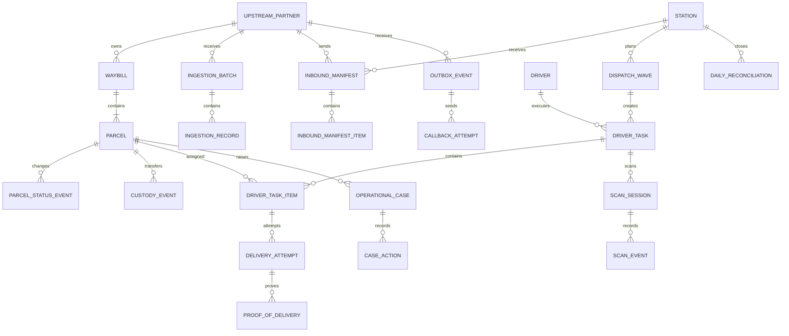

# MySQL 数据模型、字段字典与容量设计

## 1. 基线与阅读规则

当前生产基线是 Flyway `V1__baseline_schema.sql`：MySQL 8.0、InnoDB、`utf8mb4_0900_ai_ci`，时间存 UTC `DATETIME(3)`，业务主键为 `BIGINT UNSIGNED AUTO_INCREMENT`。本文描述**当前 24 张业务表**；MOV 新表必须通过后续 migration 增加，不回改 V1。

通用字段：`id` 为内部主键；`version` 为乐观锁版本；`created_at/updated_at` 为创建/最后修改时间。下文仍列出通用字段，便于开发逐字段核对。JSON 只保存协议快照或扩展元数据，禁止用 JSON 绕过核心字段建模。

Flyway V9–V10 为 `station.default_locale`、`operator_user.preferred_locale`、`driver.preferred_locale` 增加受约束的 locale，当前仅允许 `en-CA/fr-CA/zh-CN`。账户偏好可空：空值回退站点默认，再回退 `en-CA`。它们只控制展示，不参与权限、路由、状态或审计主键。

## 2. 实体关系

## 3. 主数据与身份

### 3.1 `upstream_partner`

**场景**：标识数据所属上游及接入/回调策略；接入路由和数据隔离的根。

| 字段 | 说明 |
|---|---|
| `id` | Partner 内部 ID |
| `partner_code` | URL/配置使用的稳定唯一编码 |
| `partner_name` | 展示名称 |
| `integration_mode` | `PUSH/PULL/FILE/HYBRID` |
| `status` | `ACTIVE/SUSPENDED/DISABLED`，非 ACTIVE 拒绝新接入 |
| `timezone` | 上游业务时区 IANA ID |
| `config_json` | 回调地址、非敏感映射和重试参数；不得存明文密钥 |
| `version` | 并发配置版本 |
| `created_at/updated_at` | 创建/修改时间 |

约束：`partner_code` 唯一。典型查询按 code 等值命中。

### 3.2 `station`

**场景**：末端站点、库存和运营权限的数据边界。

| 字段 | 说明 |
|---|---|
| `id` | 站点 ID |
| `station_code` | 外部可见唯一编码 |
| `station_name` | 站点名称 |
| `timezone` | 计算营业日的 IANA 时区 |
| `address_line` | 站点地址摘要 |
| `status` | `ACTIVE/SUSPENDED/CLOSED` |
| `version` | 乐观锁 |
| `created_at/updated_at` | 创建/修改时间 |

### 3.3 `driver`

**场景**：司机身份、所属站点和账户状态。

| 字段 | 说明 |
|---|---|
| `id` | Driver ID，也是 JWT subject |
| `home_station_id` | 默认站点 FK，可空表示待分配 |
| `credential_id` | 登录账号，唯一 |
| `password_hash` | BCrypt hash，不保存密码 |
| `driver_name` | 展示/交接姓名 |
| `phone` | 联系电话，敏感字段 |
| `status` | `ACTIVE/SUSPENDED/INACTIVE` |
| `version` | 乐观锁 |
| `created_at/updated_at` | 创建/修改时间 |

索引 `(home_station_id,status)` 支持本站有效司机列表。

### 3.4 `auth_session`

**场景**：刷新、撤销和审计司机登录会话。

| 字段 | 说明 |
|---|---|
| `id` | 会话 ID |
| `driver_id` | 会话所属司机 FK |
| `access_token_hash` | Access Token SHA-256，唯一 |
| `refresh_token_hash` | Refresh Token SHA-256，唯一 |
| `access_expires_at` | Access 过期时间 |
| `refresh_expires_at` | Refresh 过期时间 |
| `revoked_at` | 撤销时间；空为未撤销 |
| `created_at/updated_at` | 创建/刷新时间 |

按 `(driver_id,revoked_at)` 查询有效会话；过期且撤销的记录按安全保留期清理。

## 4. 接入、运单与包裹

### 4.1 `ingestion_batch`

**场景**：一次 Push 请求、Pull 页或文件的数量与处理结果。

| 字段 | 说明 |
|---|---|
| `id` | 接入批次 ID |
| `partner_id` | 数据来源 Partner FK |
| `external_batch_no` | 上游批次号，可空；Partner 内唯一 |
| `source_type` | `PUSH/PULL/FILE` |
| `status` | `RECEIVED/PROCESSING/PARTIAL/COMPLETED/FAILED` |
| `received_count` | 收到记录数 |
| `accepted_count` | 成功标准化数 |
| `rejected_count` | 拒绝数 |
| `started_at/completed_at` | 批次处理起止时间 |
| `created_at/updated_at` | 创建/修改时间 |

### 4.2 `ingestion_record`

**场景**：保存单条原始接入事实、幂等结果和错误，支持调查/重放。

| 字段 | 说明 |
|---|---|
| `id` | 记录 ID |
| `batch_id` | 所属批次 FK |
| `partner_id` | Partner FK，便于幂等唯一键 |
| `external_event_id` | 上游事件 ID；Partner 内唯一 |
| `external_waybill_no` | 可识别时的上游运单号 |
| `payload_json` | 原始或规范化请求快照；敏感受控 |
| `payload_sha256` | 请求摘要，识别同 key 异内容 |
| `status` | `RECEIVED/ACCEPTED/REJECTED/QUARANTINED` |
| `error_code/error_message` | 失败机器码与脱敏说明 |
| `processed_at` | 完成处理时间 |
| `created_at` | 接收时间 |

### 4.3 `waybill`

**场景**：上游商业运单和收件/服务要求；一个 Waybill 可有多件 Parcel。

| 字段 | 说明 |
|---|---|
| `id` | 运单 ID |
| `partner_id` | 所属 Partner FK |
| `external_waybill_no` | 上游运单号；Partner 内唯一 |
| `external_version` | 上游版本，用于乱序更新判断 |
| `shipper_name` | 发件方名称 |
| `recipient_name/recipient_phone` | 收件人姓名/电话，敏感 |
| `address_line1/address_line2` | 配送地址行 |
| `city/province/postal_code/country_code` | 城市、省、邮编、ISO 国家码 |
| `service_code` | 上游服务产品码 |
| `delivery_window_start` / `delivery_window_end` | 承诺时间窗；必须 start < end |
| `status` | `ACTIVE/ON_HOLD/CANCELLED/COMPLETED` |
| `source_event_time` | 上游业务事件时间 |
| `version` | 乐观锁 |
| `created_at/updated_at` | 创建/修改时间 |

### 4.4 `parcel`

**场景**：物理件当前业务投影，是扫描和派送的核心聚合。

| 字段 | 说明 |
|---|---|
| `id` | Parcel ID |
| `waybill_id` | 所属 Waybill FK |
| `tracking_no` | 全局唯一扫描码 |
| `piece_no/piece_count` | 一票多件中的件序号/总件数 |
| `current_station_id` | 当前归属站点 FK |
| `status` | Parcel 生命周期当前态 |
| `current_custody_type` | `UPSTREAM/STATION/DRIVER/RETURN_CARRIER/UNKNOWN` |
| `current_custody_id` | 对应责任主体 ID；多态引用由服务校验 |
| `current_location_code` | 分区、笼车、车辆等位置编码 |
| `route_code` | 人工或规划线路 |
| `promised_date` | 承诺配送日期 |
| `upstream_unit_no` | 上游声明的板/笼标签（V13 新增，可空）；只记录声明事实，不影响状态与 custody |
| `current_area_version_id` | 当前所属区域版本（V13 新增，可空）；活动归属的反范式投影，随归属事件在同一事务内更新 |
| `version` | 状态命令乐观锁 |
| `created_at/updated_at` | 创建/最后状态变化时间 |

索引 `(current_station_id,status,updated_at)` 支持库存队列；`(route_code,promised_date)` 支持建波次；V13 的 `(upstream_unit_no,current_station_id)` 支持按上游板/笼标签的全局统计与站级查找，`(current_station_id,current_area_version_id)` 支持区域填充与未分区筛查。`parcel_area_assignment` 保存归属历史，`current_*`（含 `current_area_version_id`）是事件投影，修改必须同时追加对应事件并在同一事务内同步投影。

### 4.5 `parcel_status_event`

**场景**：不可变 Parcel 状态时间线、审计和回传来源。

| 字段 | 说明 |
|---|---|
| `id` | 事件 ID |
| `parcel_id` | Parcel FK |
| `sequence_no` | Parcel 内严格递增序号 |
| `from_status/to_status` | 前后状态；初始事件 from 可空 |
| `event_type` | 领域事件类型，如 `PARCEL_DELIVERED` |
| `reason_code` | 失败/人工变化原因 |
| `idempotency_key` | Parcel 内命令幂等键 |
| `actor_type/actor_id` | `DRIVER/OPERATOR/SYSTEM/PARTNER` 及主体 ID |
| `metadata_json` | 非核心上下文快照 |
| `occurred_at` | 业务发生时间 |
| `created_at` | 服务端落库时间 |

### 4.6 `custody_event`

**场景**：不可变物理责任链，不等同于 Parcel 状态。

| 字段 | 说明 |
|---|---|
| `id` | 责任事件 ID |
| `parcel_id` | Parcel FK |
| `from_type/from_id` | 原责任主体类型/ID |
| `to_type/to_id` | 新责任主体类型/ID |
| `reason_code` | `STATION_RECEIPT/DRIVER_HANDOVER/DRIVER_RETURN` 等 |
| `reference_type/reference_id` | Manifest、Task 或 Session 等业务凭据 |
| `actor_id` | 执行动作人员 ID |
| `occurred_at/created_at` | 业务发生/落库时间 |

## 5. 入站、调度与扫描

### 5.1 `inbound_manifest`

**场景**：上游到站预报及整批收货关闭。

| 字段 | 说明 |
|---|---|
| `id` | Manifest ID |
| `partner_id/station_id` | 来源 Partner/目标站点 FK |
| `external_manifest_no` | 上游清单号；Partner 内唯一 |
| `expected_arrival_at/actual_arrival_at` | 预计/实际到达时间 |
| `status` | `EXPECTED/RECEIVING/DISCREPANCY/CLOSED/CANCELLED` |
| `expected_count/received_count/discrepancy_count` | 预报、实收和差异计数投影 |
| `closed_by/closed_at` | 关闭人和时间 |
| `version` | 并发关闭乐观锁 |
| `created_at/updated_at` | 创建/修改时间 |

### 5.2 `inbound_manifest_item`

**场景**：逐件预报与收货比对。

| 字段 | 说明 |
|---|---|
| `id` | 明细 ID |
| `manifest_id` | Manifest FK |
| `parcel_id` | 匹配 Parcel FK；未有数据时可空 |
| `expected_tracking_no` | 预报 tracking number |
| `receipt_status` | `EXPECTED/RECEIVED/MISSING/EXTRA/WRONG_STATION/DAMAGED` |
| `received_at/received_by` | 实收时间/操作员 |
| `discrepancy_reason` | 差异原因码 |
| `created_at/updated_at` | 创建/修改时间 |

### 5.3 `dispatch_wave`

**场景**：站点某服务日/线路的派送计划容器。

| 字段 | 说明 |
|---|---|
| `id` | Wave ID |
| `station_id` | 站点 FK |
| `wave_code` | 站点内唯一业务码 |
| `service_date` | 站点本地营业日 |
| `route_code` | 可选线路 |
| `status` | `DRAFT/PUBLISHED/IN_PROGRESS/CLOSED/CANCELLED` |
| `published_at/published_by` | 发布凭据 |
| `version` | 发布/撤回并发版本 |
| `created_at/updated_at` | 创建/修改时间 |

### 5.4 `driver_task`

**场景**：Wave 分配给一名司机的任务。

| 字段 | 说明 |
|---|---|
| `id` | Task ID |
| `wave_id/driver_id/station_id` | Wave、司机和站点 FK |
| `task_code` | 全局唯一任务码 |
| `service_date` | 服务日期 |
| `status` | `DRAFT/PUBLISHED/ACCEPTING/IN_PROGRESS/CLOSED/CANCELLED` |
| `accepted_at/started_at/closed_at` | 接受、开始和关闭时间 |
| `version` | 状态命令乐观锁 |
| `created_at/updated_at` | 创建/修改时间 |

索引 `(driver_id,status,service_date)` 是司机 App 主查询路径。

### 5.5 `driver_task_item`

**场景**：Task 与 Parcel 的分配及逐件执行状态。

| 字段 | 说明 |
|---|---|
| `id` | Task item ID |
| `task_id/parcel_id` | Task/Parcel FK |
| `stop_sequence` | 可选配送顺序 |
| `item_status` | `ASSIGNED/LOADED/OUT_FOR_DELIVERY/DELIVERED/FAILED/RETURNED/REASSIGNED/CANCELLED` |
| `active_slot` | 生成列；活动状态为 1，否则 NULL |
| `created_at/updated_at` | 分配/最后执行时间 |

唯一键 `(parcel_id,active_slot)` 利用 MySQL 多 NULL 语义防止同件存在两个活动任务。

### 5.6 `scan_session`

**场景**：司机 LOAD、RETURN 或 TRANSFER 的扫描与审批会话。

| 字段 | 说明 |
|---|---|
| `id` | Session ID |
| `task_id/driver_id` | Task/Driver FK |
| `session_type` | `LOAD/RETURN/TRANSFER` |
| `status` | `OPEN/SUBMITTED/APPROVED/REJECTED` |
| `expected_count/scanned_count/discrepancy_count` | 应扫、有效实扫和差异计数 |
| `opened_at/submitted_at` | 开启/提交时间 |
| `reviewed_by/reviewed_at` | 审批人/时间 |
| `version` | 提交/审批乐观锁 |

### 5.7 `scan_event`

**场景**：不可变的单次设备扫描事实。

| 字段 | 说明 |
|---|---|
| `id` | Scan event ID |
| `session_id` | Session FK |
| `parcel_id` | 匹配 Parcel FK；未知码可空 |
| `tracking_no` | 实际扫描字符串 |
| `device_event_id` | 客户端 UUID，全局幂等 |
| `result_code` | `EXPECTED/EXTRA/DUPLICATE/WRONG_TASK/UNKNOWN` |
| `latitude/longitude` | 可选扫描位置 |
| `scanned_at/created_at` | 设备发生/服务端落库时间 |

## 6. 配送、异常、回传与关站

### 6.1 `delivery_attempt`

**场景**：每次妥投或失败尝试。

| 字段 | 说明 |
|---|---|
| `id` | Attempt ID |
| `task_item_id/parcel_id/driver_id` | 执行明细、包裹和司机 FK |
| `attempt_no` | Parcel 内从 1 递增 |
| `outcome` | `DELIVERED/FAILED` |
| `failure_reason_code` | 失败必填原因 |
| `recipient_name` | 实际接收人，敏感 |
| `latitude/longitude` | 尝试位置 |
| `idempotency_key` | Driver 内命令幂等键 |
| `attempted_at/created_at` | 发生/落库时间 |

### 6.2 `proof_of_delivery`

**场景**：Attempt 的照片、签名、OTP、收件人或定位证据元数据。

| 字段 | 说明 |
|---|---|
| `id` | POD ID |
| `attempt_id` | Attempt FK |
| `pod_type` | `PHOTO/SIGNATURE/OTP/RECIPIENT/GEOLOCATION` |
| `object_uri` | 私有对象存储 URI |
| `content_sha256` | 内容完整性摘要 |
| `content_type/content_size` | MIME 和字节数 |
| `captured_at` | 客户端采集时间 |
| `metadata_json` | OTP 校验结果、关系等扩展元数据 |
| `created_at` | 上传完成时间 |

### 6.3 `operational_case`

**场景**：需要人工负责并按 SLA 关闭的运营异常。

| 字段 | 说明 |
|---|---|
| `id/case_no` | 内部 ID/唯一业务编号 |
| `case_type` | 地址、少货、破损、回调拒绝等类型 |
| `parcel_id/station_id` | 可选关联 Parcel/站点 FK |
| `priority` | `LOW/NORMAL/HIGH/CRITICAL` |
| `status` | `OPEN/ASSIGNED/WAITING_EXTERNAL/RESOLVED/CLOSED` |
| `owner_type/owner_id` | 队列、角色或用户及 ID |
| `sla_due_at` | 到期时间 |
| `resolution_code/resolution_note` | 解决码/说明 |
| `version` | 并发领取/处理版本 |
| `created_at/updated_at/resolved_at/closed_at` | 生命周期时间 |

### 6.4 `case_action`

**场景**：不可变的 Case 处理历史。

| 字段 | 说明 |
|---|---|
| `id/case_id` | Action ID/Case FK |
| `action_type` | CREATE、ASSIGN、COMMENT、DECIDE 等 |
| `from_status/to_status` | 动作前后状态 |
| `actor_type/actor_id` | 操作者类型/ID |
| `note` | 脱敏操作说明 |
| `metadata_json` | 结构化决策上下文 |
| `created_at` | 动作时间 |

### 6.5 `outbox_event`

**场景**：与领域事务原子写入、等待可靠发布的事件。

| 字段 | 说明 |
|---|---|
| `id` | Outbox ID |
| `aggregate_type/aggregate_id` | 来源聚合类型/ID |
| `event_type/event_key` | 事件类型/全局稳定幂等键 |
| `partner_id` | 目标 Partner FK，可空表示内部事件 |
| `payload_json` | 版本化事件负载 |
| `status` | `PENDING/PROCESSING/RETRY/ACKNOWLEDGED/DEAD_LETTER` |
| `attempt_count/next_attempt_at` | 尝试次数/下次时间 |
| `locked_at/locked_by` | Worker lease |
| `acknowledged_at` | 上游确认时间 |
| `last_error` | 最近脱敏错误 |
| `created_at/updated_at` | 创建/修改时间 |

### 6.6 `callback_attempt`

**场景**：每一次具体外部回调的技术证据。

| 字段 | 说明 |
|---|---|
| `id/outbox_event_id` | Attempt ID/Outbox FK |
| `attempt_no` | Outbox 内尝试序号 |
| `request_url` | 脱敏目标 URL |
| `request_sha256` | 请求内容摘要 |
| `response_status` | HTTP 状态码 |
| `response_body_excerpt` | 截断并脱敏的响应摘要 |
| `outcome` | `ACKNOWLEDGED/RETRYABLE_FAILURE/PERMANENT_FAILURE` |
| `error_message` | 网络或协议错误 |
| `started_at/completed_at/created_at` | 调用起止和记录时间 |

### 6.7 `daily_reconciliation`

**场景**：站点营业日库存平衡、未闭环项和主管签字。

| 字段 | 说明 |
|---|---|
| `id/station_id/business_date` | 记录 ID、站点和本地营业日；站点+日期唯一 |
| `opening_count` | 期初站点库存 |
| `inbound_count/transfer_in_count` | 到站/转入 |
| `dispatched_count` | 交给司机数量 |
| `driver_return_count` | 司机交回数量 |
| `delivered_count` | 当日妥投数量 |
| `transfer_out_count/upstream_return_count` | 转出/退上游数量 |
| `expected_closing_count` | 公式计算期末 |
| `actual_closing_count` | 实际库存快照 |
| `variance_count` | actual - expected |
| `open_case_count` | 关站时开放异常数 |
| `status` | `OPEN/REVIEW_REQUIRED/SIGNED_OFF` |
| `carryover_reason` | 不平项结转说明 |
| `signed_off_by/signed_off_at` | 主管及签字时间 |
| `created_at/updated_at` | 创建/重算时间 |

## 7. 查询、索引与联表原则

核心在线查询必须从选择性最高的租户/站点/司机和状态开始，并使用 keyset pagination：

- Driver tasks：`driver_task(driver_id,status,service_date)` → task items → parcel/waybill。
- Station inventory：`parcel(current_station_id,status,updated_at,id)`；大页使用 `(updated_at,id)` 游标。
- Manifest：`inbound_manifest(station_id,status,expected_arrival_at)` → item。
- Case queue：`operational_case(status,owner_type,owner_id,sla_due_at)`。
- Outbox worker：`outbox_event(status,next_attempt_at,id)`，只读取到期小批量。
- Timeline：按 `parcel_id` 分别读取 status/custody/attempt，服务层合并；禁止无时间范围全表 UNION。

新增查询在合并前必须提供实际或接近实际数据量下的 `EXPLAIN ANALYZE`。列表禁止 `SELECT *`、无上限、offset 深翻页和逐行 N+1。运营汇总不得长期直接扫描事件大表；使用日汇总或只读分析存储。

## 8. 容量、历史数据与归档计划

容量模型以 `日 Parcel × 每 Parcel 事件数 × 保留日` 估算。试运营收集真实基线；当事件表达到 1 亿行、单表超过约 100 GB、索引无法进入可用内存或 p95 超标时，依据实际查询键评估按 `occurred_at/created_at` 月分区，而不是预先分区。

建议初始保留策略（最终由合同/法规确认）：在线 Waybill/Parcel 24 个月；status/custody/attempt/case/audit 24–84 个月；原始 payload 90–180 天后加密归档；callback attempt 180 天；已撤销 session 90 天；POD 90 天至 24 个月。归档作业按主键小批量执行，有速率限制、校验计数和可恢复 checkpoint；归档后敏感字段按策略匿名化。

POD/GPS 不放大 MySQL：文件进入对象存储；若未来增加高频轨迹，使用独立时序/分析存储。删除 Partner 数据时必须按 FK 依赖顺序、法律保留和审计要求执行，禁止业务 API 物理级联删除。

## 9. MOV 数据模型缺口

I02 已通过 V3 增加 `station.city/province_code/country_code`、一城一站约束、`station_service_area`，并在 Waybill 增加当前结果 `routing_status/resolved_station_id/routing_reason_code/routed_at`。路由算法、中间候选和排除过程不入业务表；系统失败进入 `operational_case`，人工覆盖写 `case_action`。后续增加 operator user/role/default station/audit、reason-code configuration、idempotency command record、reconciliation detail 和 partner credential/version。每项新增前必须更新本字典、ER 图、迁移、索引依据、权限和保留期。

I04 V5 新增 `inbound_scan_event`，以 `(manifest_id, device_event_id)` 保证扫码设备重试幂等，并记录 tracking、条件、分类结果、item、操作人和发生时间。`operational_case.inbound_manifest_id/manifest_item_id` 将少货、多货、错站、破损差异明确关联至 Manifest。Manifest 的计数字段是查询投影，每次命令均从 Item 状态重算；Item 与 Scan Event 才是收货事实依据。

I05 V6 为 `scan_session` 增加活动槽生成列及 `(task_id,session_type,active_slot)` 唯一约束，保证一个任务同类型至多一个 OPEN/SUBMITTED Session；为站点库存候选查询增加 `(current_station_id,status,current_custody_type,updated_at)` 索引。`driver_task_item.active_slot` 继续保证一个 Parcel 至多属于一个活动任务。发布只改变分配状态；批准装车才产生站点到司机的 custody event。

I06 V7 新增 `delivery_failure_reason` 配置失败证据、下一动作和尝试上限；Attempt 增加 `failure_note/next_action`，Return Session 增加处理结论。RETURN 复用 Scan Event 幂等事实；主管批准后才写司机到站点/上游 custody。地址异常只建 Case，开放 Case 继续阻断调度，不自动重路由。
## 13. R01 空间区域模型

- `delivery_area`：站点内稳定的区域身份；`(station_id, area_code)` 唯一，`area_level` 支持大区/小区而不引入组织层级。
- `delivery_area_version`：不可变边界版本；`boundary` 为 SRID 4326 `MULTIPOLYGON` 并建空间索引，`geojson_snapshot` 保存导入原貌，状态为 `DRAFT/VALIDATED/PUBLISHED/RETIRED`，校验、变更原因、生效时间和审批字段支持追溯。每区域仅一个 `PUBLISHED` 版本。
- `driver_area_preference`：长期默认司机偏好，含优先级和有效期；它不是当天实际任务分配。
- `waybill_geocode`：地址地理编码结果、精度、提供方和坐标；`location` 建空间索引，失败仍保留状态和原因。
- `parcel_area_assignment`：包裹匹配到具体区域版本的决策，记录 `AUTO/MANUAL`、置信度、原因和操作人；后续边界变化不改写历史。

性能策略：列表使用站点/状态 B-tree 索引；点面匹配使用空间索引；规划查询禁止跨站全表扫描。区域版本和归属按历史保留，后续在 R07 按营业日期归档高增长审计/事件数据，不删除运单责任链。
# R02 规划模型补充

- `driver_shift`：司机营业日运力快照。`(driver_id,service_date)` 唯一；`station_id` 用于站点查询和隔离；`availability_status` 是出勤门禁；`parcel_capacity` 是当日全部活动任务的硬上限；`note/version` 支持运营说明和并发演进。
- `dispatch_wave.frozen_at/frozen_by`：记录预检通过的冻结事实。状态增加 `FROZEN`，从此禁止普通分配/改派；发布只允许从该状态执行。
- `driver_task_area`：记录任务使用的 `delivery_area_version_id`，而不是可变区域；`assignment_mode` 区分 `WHOLE_AREA/PARTIAL_AREA`，用于复盘整区和拆分决策。
- `driver_task_item`：仍是逐件派送计划事实，生成列 `active_slot` 与唯一键阻止一个包裹同时属于两个活动任务。改派保留旧行为 `REASSIGNED`，不会覆盖历史。

性能上，班次使用 `(station_id,service_date,availability_status)`，任务使用 `(station_id,service_date,status,driver_id)`；区域版本和地理点保留 Spatial Index。地图查询必须带站点，生产大数据量时带视口并限制 2,000 点；历史批次关闭后不参与当日容量统计，长期数据按营业日归档/分区评估，而不删除审计事实。
