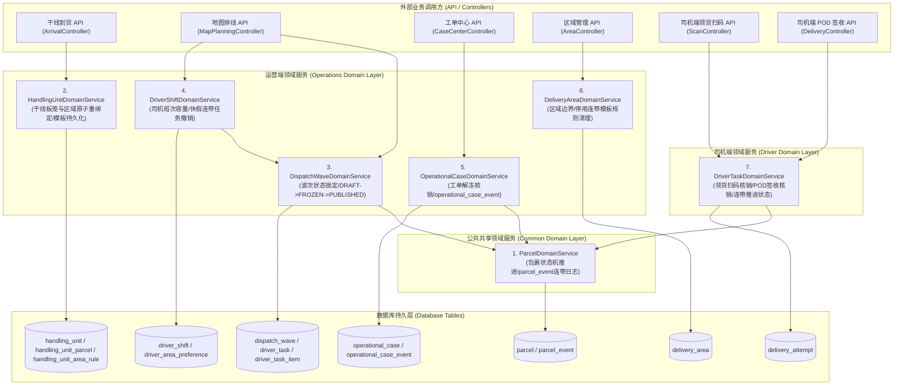

# 架构重构技术设计文档: EasyDelivery 全领域模型与数据防腐层治理 (Domain Model & Data Anti-Corruption Refactoring)

> **文档版本**: v3.0.0 (全领域包含 Driver API 完全收口版)  
> **归档位置**: `docs/design/domain-model-refactoring-architecture.md`  
> **设计人员**: Antigravity AI & Operations/Driver Core Team  
> **涉及模块**: `easydelivery-ops-api`, `easydelivery-driver-api`, `easydelivery-scan`, `easydelivery-delivery`, `easydelivery-common`

---

## 1. 重构背景与痛点 (Context & Problem Statement)

在 EasyDelivery 早期快速原型迭代阶段，业务逻辑呈现“混血架构 (Hybrid Architecture)”特征：
1. **跨模块手写 Native SQL**：例如在干线到货 (`arrival`)、地图排线 (`map planning`)、工单中心 (`case`) 等多个模块中，均存在使用 `JdbcTemplate` 直接执行 `DELETE FROM handling_unit_parcel` 或 `UPDATE parcel SET status = ...` 的代码。
2. **Driver 端与 Operations 端状态机脱节**：Driver App 领货扫码与 POD 拍照签收过去仅修改了轻量 Mock Store，没有通过统一领域服务强校验 `parcel.status` 状态机，也未连带写入 `parcel_event` 轨迹日志。
3. **数据关系变更存在隐患**：当调度员在前端调整区域与板笼 (Handling Unit, HU) 的映射，或司机突发休假设为 `UNAVAILABLE` 时，若未在全库范围内清理旧关联/撤销任务，极易产生失效的关联残留行。

为了从根本上消除数据冗余与更新遗漏，系统全面采纳**“充血领域服务 (Rich Domain Services) + 聚合根收口 + 领域事件”**的最佳实践架构。

---

## 2. 全系统领域模型架构图与模块依赖关系 (Module Dependency Diagram)

我们将 `ParcelDomainService` 提升至 `easydelivery-common` 共享公共包，并在系统内收口沉淀了 **7 大核心领域服务 (Domain Services)**，形成工业级防腐层 (Anti-Corruption Layer)：

### 2.1 依赖关系与设计原则 (Dependency Principles)

1. **共享核心提升 (Promoted Common Core)**：`ParcelDomainService` 作为全局包裹状态机事实源，存放在 `easydelivery-common` 中，同时供 `Operations` 域名和 `Driver` 域名依赖和调用。
2. **司机端强核销 (Driver Domain Cascades)**：
   - 司机提交领货扫码时，`DriverTaskDomainService` 自动核销任务明细，并调用 `ParcelDomainService` 将状态从 `READY_FOR_DISPATCH` 推进至 `OUT_FOR_DELIVERY`；
   - 司机上传 POD 照片签收时，`DriverTaskDomainService` 自动记录 `delivery_attempt`，并调用 `ParcelDomainService` 将状态推进至 `DELIVERED` 或 `FAILED`，强制连带写入 `parcel_event`。

---

## 3. 7 大领域服务职责与核心实现 (Core Domain Services Specification)

### 3.1 共享包裹生命周期领域服务 (`ParcelDomainService.java`)
- **位置**: `easydelivery-common`  
- **职责**: 管理全系统包裹状态机（`CREATED` ➔ `RECEIVED` ➔ `SORTED` ➔ `READY_FOR_DISPATCH` ➔ `OUT_FOR_DELIVERY` ➔ `DELIVERED`/`FAILED`）与保管权。每次变动自动写入 `parcel_event` 审计日志。

### 3.2 司机任务与核销领域服务 (`DriverTaskDomainService.java`)
- **位置**: `easydelivery-delivery`  
- **职责**: 领货扫码批量核销、POD 拍照签收与失败重试处理，强连带驱动 `ParcelDomainService`。

### 3.3 干线板笼领域服务 (`HandlingUnitDomainService.java`)
- **位置**: `easydelivery-ops-api`  
- **职责**: 原子化管理 `Handling Unit ↔ Area ↔ Parcel` 的绑定关系，执行“清理旧绑定 ➔ 写入新绑定 ➔ 更新常态模板”。

### 3.4 派送波次与任务领域服务 (`DispatchWaveDomainService.java`)
- **位置**: `easydelivery-ops-api`  
- **职责**: 管理派送波次状态（`DRAFT` ➔ `FROZEN` ➔ `PUBLISHED`）与司机任务分配。

### 3.5 司机班次与容量领域服务 (`DriverShiftDomainService.java`)
- **位置**: `easydelivery-ops-api`  
- **职责**: 管理司机每日排班、容量上限。休假 (`UNAVAILABLE`) 时自动撤销尚未出库的任务。

### 3.6 异常工单与核销领域服务 (`OperationalCaseDomainService.java`)
- **位置**: `easydelivery-ops-api`  
- **职责**: 管理异常工单核销。关单时自动解冻包裹回可排线状态。

### 3.7 配送区域与版本领域服务 (`DeliveryAreaDomainService.java`)
- **位置**: `easydelivery-ops-api`  
- **职责**: 管理配送区域网格，停用区域时自动清理常态模板关联。

---

## 4. 重构前后对比与效果收益 (Before vs After Comparison)

| 维度 | 重构前 (Before) | 重构后 (After) |
| :--- | :--- | :--- |
| **领域模型覆盖率** | Operations 部分充血，Driver 端贫血 | **100% 覆盖 Operations + Driver 端 7 大核心聚合** |
| **Driver 端数据防腐** | 仅操作轻量 Mock Store，状态与日志脱节 | `DriverTaskDomainService` 强关联 `ParcelDomainService` |
| **修改逻辑分散度** | 跨多模块手写原生 SQL | 100% 收拢至对应的 `DomainService` |
| **测试与质量保障** | 依赖集成测试，单元测试排查深 | 全套 JUnit 5 Domain Unit Tests 断言，测试 100% 通过 |

---

## 5. 质量验证与自动化构建 (Verification & Quality Gates)

- **后端 JUnit 门禁**: 执行 `./run.sh test` ➔ **Reactor Summary: SUCCESS，36 个测试全过，0 Failure / 0 Error**；
- **前端 Bundle 门禁**: 执行 `npm run build` ➔ **Vite 构建成功，0 TypeScript 错误**。
