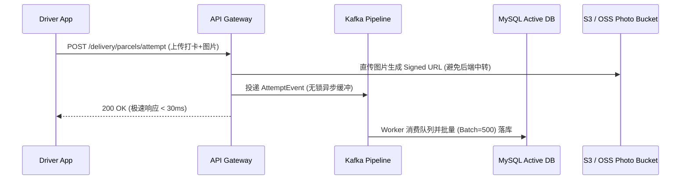
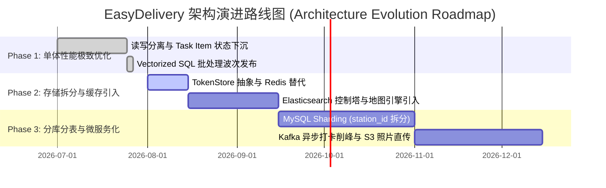

# 🚀 EasyDelivery 百万级 (1M+ Daily Parcels) 物流系统技术架构演进方案书

> **文档版本**: v1.0.0 (Architecture Baseline)  
> **适用场景**: 支撑每日 100 万 ~ 500 万包裹履约、北美/多城市多站点并发、高并发司机端打卡与实时控制塔监控。  
> **对应基线**: `docs/design/last-mile-system-design.md` & `docs/agent-development-methodology.md`  

---

## 📌 一、 演进背景与性能瓶颈诊断 (Context & Bottlenecks)

随着业务拓展至北美多城市（如多伦多 YYZ、温哥华 YVR、蒙特利尔 YUL 等）及单日包裹处理量迈入 100 万（1M+）级别，现有单体架构将面临以下四个维度的**极端性能与稳定性瓶颈**：

| 维度 | 当前架构限制 (单体 + MySQL) | 百万级 (1M+ Parcels) 场景下的瓶颈表现 |
| :--- | :--- | :--- |
| **1. 高频写入 (Write Pressure)** | 早高峰 10,000+ 司机集中交接/扫码，在线打卡/上传 POD | 单表 `delivery_attempt` 快速破亿，数据库 I/O 阻塞，死锁频发。 |
| **2. 批量波次发布 (Batch Dispatch)** | 单站点 10万件波次批量生成任务明细 | 数据库长事务导致锁表、Undo Log 暴涨，其他司机打卡被阻塞。 |
| **3. 实时控制塔 (Control Tower)** | 控制塔看板包含多表联查 `COUNT` 统计 | SQL 大表全表扫描，监控页面响应延迟破秒级甚至超时。 |
| **4. 缓存与 Session 瓶颈** | 依赖数据库/本地 TokenStore 校验用户身份 | 高频 API 验证带来巨大 DB 读压力，无法支持多实例横向扩展。 |

---

## 🏗️ 二、 目标总体架构设计 (Target Enterprise Architecture)

为了支撑百万级包裹，系统采用 **“CQRS 读写分离 + 微服务/模块解耦 + 异步事件驱动 + 分库分表 + Redis/ES 多维索引”** 的分布式架构。

```mermaid
flowchart TB
    subgraph API Gateway & Edge Layer
        GW[API Gateway / Nginx] -->|Token 校验 / 流量限流| AUTH[Auth & Session Service]
    end

    subgraph Service Layer (Applications)
        GW -->|Integration API| INGEST[Shipment Ingestion Service]
        GW -->|Operations API| OPS[Operations & Control Tower Service]
        GW -->|Driver API| DRIVER[Driver Execution Service]
    end

    subgraph Messaging & Caching Layer (Async Core)
        INGEST -->|Kafka Event: parcel.ingested| KAFKA[Kafka Cluster]
        DRIVER -->|Kafka Event: attempt.created| KAFKA
        OPS -->|Kafka Event: wave.published| KAFKA
        KAFKA -->|Vectorized Worker| CONSUMER[Batch Processing Workers]
        AUTH --- REDIS[(Redis Cluster / Cache & Token)]
    end

    subgraph CQRS Multi-Storage Architecture
        CONSUMER -->|Write Mutations| SHARD_DB[(MySQL Sharding / Partition DB)]
        CONSUMER -->|Sync Projections| ES[(Elasticsearch Cluster)]
        CONSUMER -->|Real-time Counters| REDIS
    end

    subgraph Storage Division
        SHARD_DB -->|Sharded by station_id / parcel_id| PARCEL_DB[(Parcel & Task Master DB)]
        ES -->|Full-text & GIS Range| ES_SEARCH[Control Tower & Map Planning Engine]
    end
```

---

## 🗄️ 三、 数据库与存储架构演进 (Storage & Sharding Strategy)

### 3.1 数据库分库分表与分区 (Sharding Strategy)
在 100 万件/日，年积累 3.5 亿件包裹的体量下，物理单表必须进行水平切分（Sharding）：

1. **分片键选择 (Sharding Key)**：
   * **`parcel` / `waybill` 表**：采用 **`station_id` (哈希/范围) + `parcel_id`** 双维度分片。按 `station_id` 路由可确保同网点的调度与查询落入同一数据库节点，避免跨库 Distributed Join。
   * **`driver_task` / `driver_task_item` 表**：按 **`station_id` + `service_date`** 进行按月/按天物理分区（Range Partitioning），支持日终关站后的归档冷热分离。
2. **冷热数据自动归档 (Cold Data Archiving)**：
   * **热数据表 (`parcel_active`)**：仅保留最近 30 天的在线履约包裹（保持在 3,000 万条以内极速查询）；
   * **历史归档表 (`parcel_history`)**：履约关单 30 天后，定时任务增量迁移至历史库或 ClickHouse 报表分析库。

### 3.2 CQRS 架构与 Elasticsearch / Redis 读写分离
* **写侧 (Command Side)**：数据落入 MySQL 分片库，利用乐观锁 `@Version` 保证强一致性。
* **读侧 (Query Side)**：
  * **控制塔与 SPH 看板**：统计数据直接读取 **Redis 实时 Hash 计数器**，响应时间 < 2ms。
  * **地图排线与大列表搜索**：通过 Debezium / Canal 监听 MySQL Binlog 实时同步至 **Elasticsearch**，地图划圈和模糊搜索全部走 ES 引擎。

---

## ⚡ 四、 100万级包裹波次发布与批量指派方案 (Vectorized & Async Dispatch)

为了解决 10 万件/站点波次发布导致的数据库锁表问题，采用 **“向量化 SQL + 异步任务队列 + Chunking 事务”**：

### 4.1 异步任务化与 Outbox 模式
1. 运营人员点击“一键发布 10 万件波次”，前端立刻收到 `202 Accepted` 及 `job_id`，避免 HTTP 请求超时。
2. 调度引擎将波次切分为固定大小的 **Chunk (每批 5,000 件)** 投递至 Kafka / RabbitMQ。

### 4.2 向量化集合插表 (Set-Based Execution)
在数据库层面抛弃 Java 内存循环，使用基于 `INSERT ... SELECT` 的直接集合写入：

```sql
-- 5,000 件 Chunk 批处理集合插入明细（单次耗时 < 50ms）
INSERT INTO driver_task_item (task_id, parcel_id, item_status, stop_sequence, is_test)
SELECT :taskId, p.id, 'ASSIGNED', ROW_NUMBER() OVER (ORDER BY p.id), p.is_test
FROM parcel p
WHERE p.current_station_id = :stationId 
  AND p.promised_date = :serviceDate 
  AND p.status = 'READY_FOR_DISPATCH'
  AND p.id IN (:chunkParcelIds);

-- Chunk 分块短事务更新包裹状态
UPDATE parcel 
SET status = 'ASSIGNED', version = version + 1 
WHERE id IN (:chunkParcelIds);
```

---

## 📈 五、 在途打卡与高频写保护 (High-Concurrency Ingestion Protection)

在早高峰 10,000+ 司机集中打卡/上传 POD 照片的场景下，系统必须提供高可用写保护：



1. **媒体文件直传 (Direct S3 Upload)**：司机 POD 照片通过预签名 URL (Presigned URL) 直接上传至 S3/OSS 对象存储，后端微服务不承载任何图片文件流量。
2. **削峰填谷 (Traffic Shaving via Kafka)**：司机端打卡请求先落 Kafka 队列，后端 Consumer 以每批 500 条做 `batchUpdate` 刷盘，彻底平滑数据库写峰值。

---

## 🛡️ 六、 容灾、隔离与影子隔离机制 (Shadow Testing & Resilience)

1. **生产环境影子全流程隔离 (`is_test`)**：
   * 所有数据表保留 `is_test` 字段，影子测试包裹 (`is_test = 1`) 必须在 SQL / ES 层面通过全局拦截器自动追加 `AND is_test = 0` 条件，避免自动化探针测试污染真实的财务报表与控制塔 KPI。
2. **站点级降级与限流 (Rate Limiting)**：
   * 基于 API Gateway 对不同站点配置配额限流（如单站点限制 5,000 QPS）。当网点系统出现异常时，熔断机制降级非核心查询（如暂停历史轨迹实时搜索），优先保障司机端“打卡妥投”主流程畅通。

---

## 🏁 七、 演进路线图与阶段划分 (Architecture Roadmap)



---
*本技术文档落盘于 `docs/design/high-concurrency-1m-architecture-design.md`，可作为系统演进的指导规范。*
