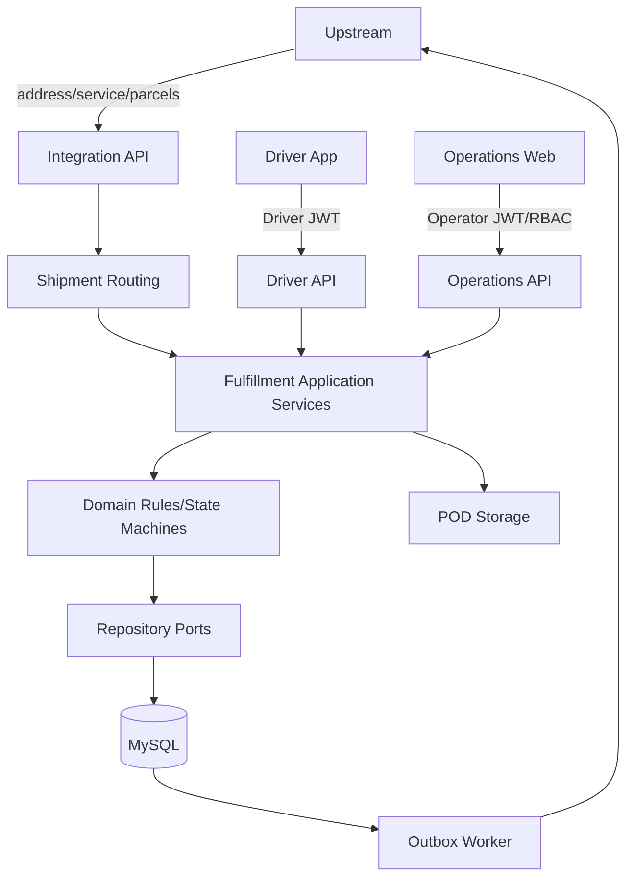
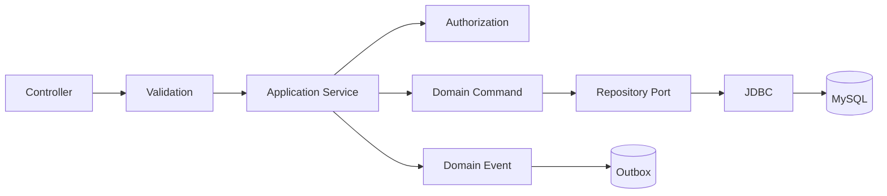
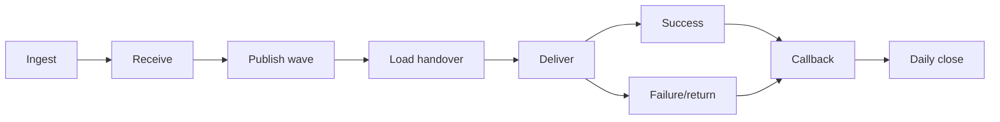
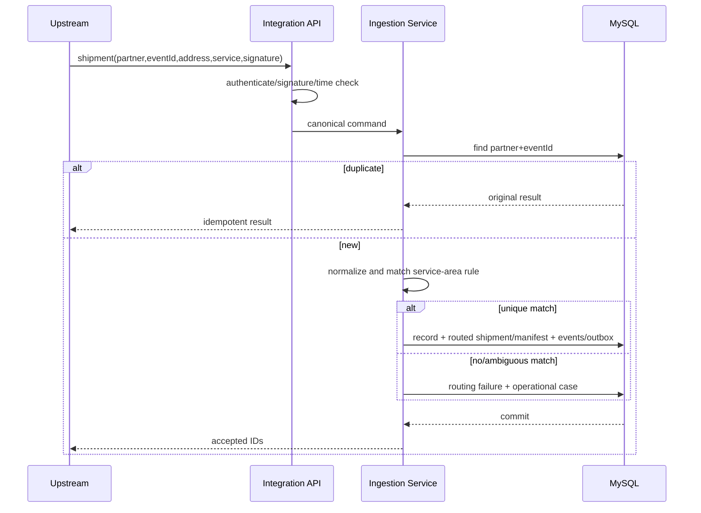
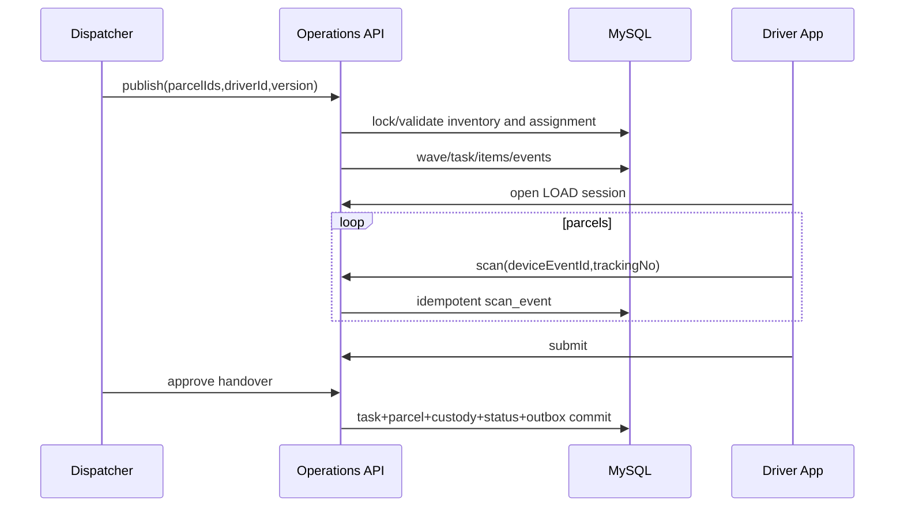
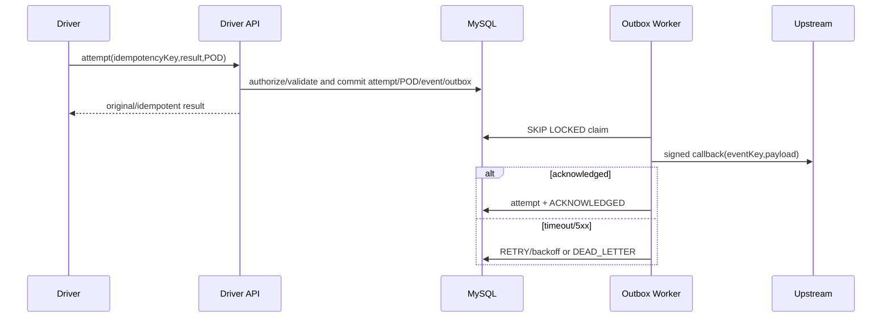

# OpenDelivery Top-Level System Design

## 1. Goal, Current State, and Boundary

The system uses Java 17, Spring Boot 3.3, MySQL 8, and Flyway. The current Maven modular monolith implements driver authentication, task search, scanning, delivery/POD, Canonical upstream push, basic operations commands, and Outbox. The target keeps one deployable serving multiple cities with exactly one station each; organization hierarchy, transfers, and microservices are excluded.

Two product subsystems exist: Driver App Backend and Operations System (Web + API). Integration API is a shared platform entry, not a third product.



## 2. Modules and Dependency Rules

| Current module | Responsibility | Allowed dependency |
|---|---|---|
| `easydelivery-app` | boot/config, Integration and Operations APIs, schedulers | auth/delivery/scan/common |
| `easydelivery-auth` | driver register/login/refresh/logout | common |
| `easydelivery-delivery` | driver tasks, attempts, POD | common |
| `easydelivery-scan` | sessions and scan facts | common |
| `easydelivery-common` | contracts, repository ports/JDBC, common errors | Spring/JDBC only |

Target logical modules are `identity-access`, `partner-integration`, `shipment-routing`, `shipment`, `station-operations`, `dispatch`, `driver-execution`, `case-management`, and `platform-infrastructure`. Routing code owns normalization, rule selection, conflict handling, and lifecycle gates. Establish package boundaries before physical Maven splits.

Dependencies flow `API Adapter → Application Service → Domain → Repository Port`; infrastructure implements ports. Controllers do not orchestrate cross-aggregate transactions, repositories do not choose business transitions, and modules do not directly mutate another module's owned tables.

## 3. Component Relationship and Transaction Boundary



For example, load-handover approval locks task/parcels, validates discrepancy, updates task items and current projections, appends custody/status events, and writes Outbox in one transaction.

## 4. Main Flow



Waybill/Parcel, Manifest, Wave/Task, Scan, Custody, Attempt/POD, Case, Outbox/Callback, and Reconciliation each hold different facts. Parcel status cannot replace them.

## 5. Main Sequences

### 5.1 Ingestion and Station Routing



### 5.2 Dispatch and Handover



### 5.3 Delivery and Callback



## 6. Token, Authorization, and API Security

Driver login verifies BCrypt and issues a two-hour access JWT plus opaque refresh token. JWT `sub` is driver ID. The interceptor validates signature, expiry, and non-revoked DB session; application code trusts request context, never body `driver_id`. Only SHA-256 token hashes are stored; refresh rotates both tokens. MOV adds device identity, signing-key version, rate limit, and multi-device policy.

Operator identity is separate. The operator JWT identifies user; active roles and station grants are loaded server-side. Authorization checks role + action + station and audits high-risk commands. `X-Ops-Api-Key` is migration-only.

MOV partners use TLS, per-partner secret, HMAC-SHA256, `X-Partner-Code`, `X-Timestamp`, `X-Nonce`, and `X-Signature`. The signature covers method, path, timestamp, nonce, and body digest. Allow five-minute clock skew and one nonce per window. Enforce partner rate/body limits and load versioned secrets from secret management. The current global upstream key is not the target multi-partner control.

## 7. Station Routing and Partner Adaptation

`ShipmentRoutingService` receives normalized address and service code, reads active `station_service_area`, and deterministically selects by exact/longest postal prefix, then city+province+country, then priority. Code owns the algorithm and state gates; configuration only declares coverage. Result is `ROUTED/UNROUTABLE/AMBIGUOUS`; Waybill stores current result. Do not persist all candidates or branch steps. Failure creates a Case, manual override uses general audit, and no automatic reroute occurs after physical receipt.

Every operation carries station context and validates manifest/parcel/wave/task/driver/reconciliation consistency. Ordinary operators have a default station; admins may switch. This is not a full tenant model, but cross-station business mixing is rejected. All stations use one business-timezone policy and close independently.

```java
interface PartnerAdapter {
    boolean supports(String partnerCode, String contentType);
    CanonicalShipment parseAndValidate(byte[] rawPayload);
    PartnerCallback mapOutbound(DomainEvent event);
}
```

Persist raw input/digest before adapting. Version simple field/enum maps as configuration; implement complex splits, signatures, and ordering in code. MOV includes `GenericCanonicalJsonAdapter`; implement the full framework with the second real partner.

## 8. Consistency, Concurrency, and Idempotency

- Domain update, immutable event, and Outbox commit together.
- Mutable aggregates use `version`; resource races such as publish use short row locks.
- Keys: partner+external event, device event, and driver+delivery command.
- Store request hash with idempotency; same key/different payload returns 409.
- Outbox uses `FOR UPDATE SKIP LOCKED`, lease, exponential retry, and dead letter; replay preserves history.
- Store UTC; API uses offset ISO-8601; station timezone defines business date.

## 9. Files, Privacy, and Audit

POD binaries live in private object storage; MySQL stores URI, digest, MIME, size, and capture time. Enforce MIME/extension/size/count, random keys, malware scan, and short authorized read URLs. Names, phones, addresses, locations, and POD are sensitive: redact logs, encrypt transit/backups, and archive/anonymize per partner policy. Audit is append-only and separate from normal logs.

## 10. Observability, SLO, and Deployment

Correlate `requestId/partnerId/batchId/parcelId/taskId/driverId`. MOV measures ingestion rejection, inbound/load discrepancy, open tasks, driver custody, missing POD, overdue cases, Outbox depth/dead letters, and callback delay. Pilot data establishes baseline; `1.0` approves formal SLOs.

Deploy one app plus MySQL and object storage. Flyway migrations are forward-only and use expand/migrate/contract with at least one-version compatibility. Backup restore, migration dry-run, smoke test, and rollback conditions are release gates.

## 11. Evolution

`0.5 MOV` adds multi-city station routing, operator RBAC, inbound discrepancy, publication gates, bilateral handover, failed return, cases, callback workbench, and per-station closeout. `1.0` adds adapters, monitoring, recovery, and capacity evidence.
