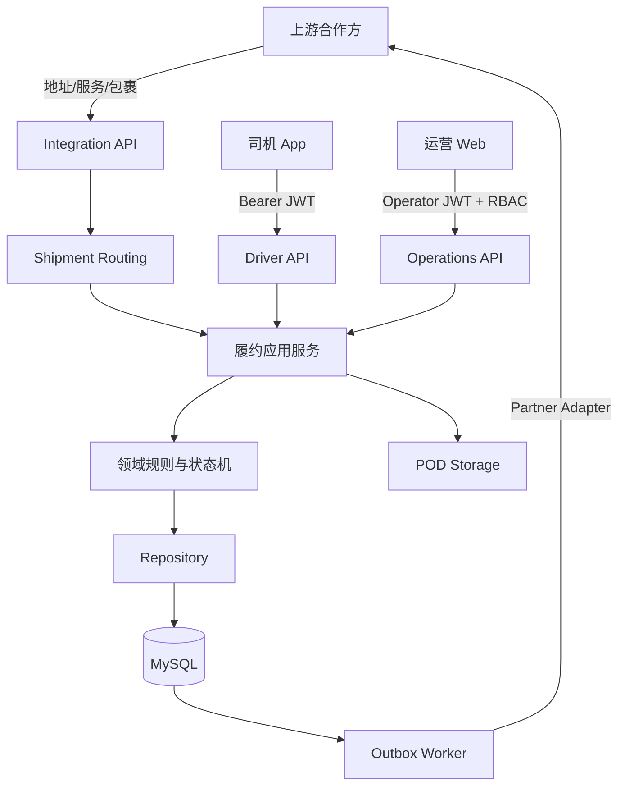
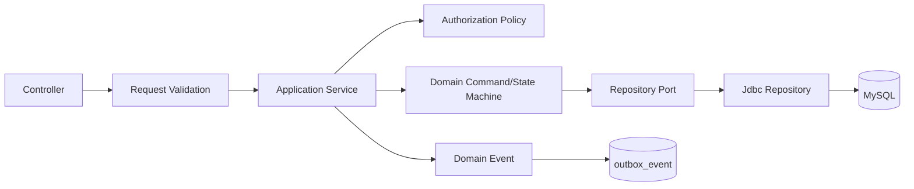
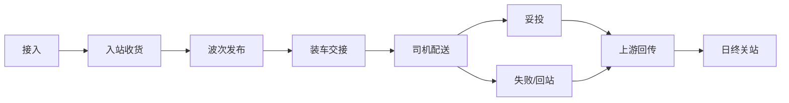
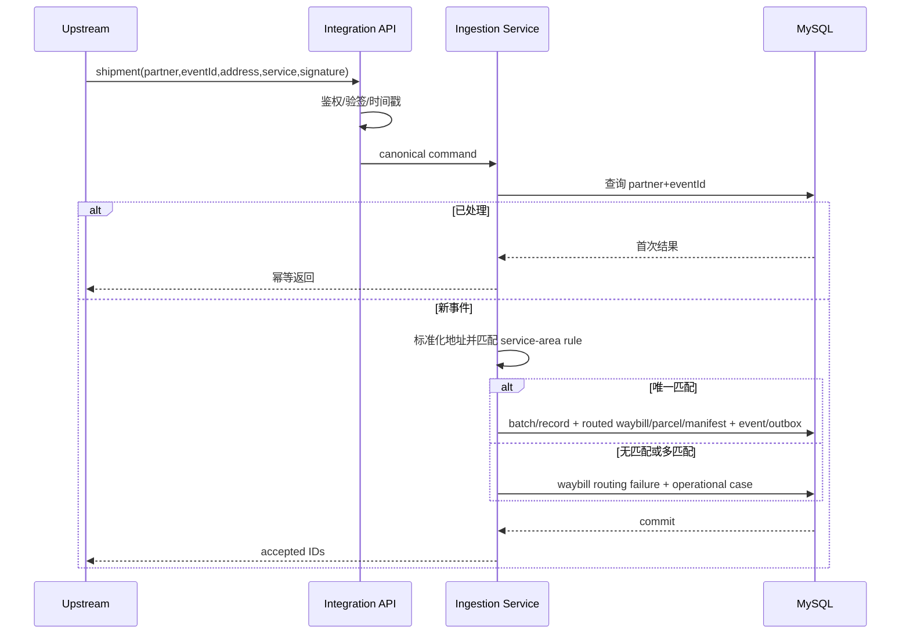
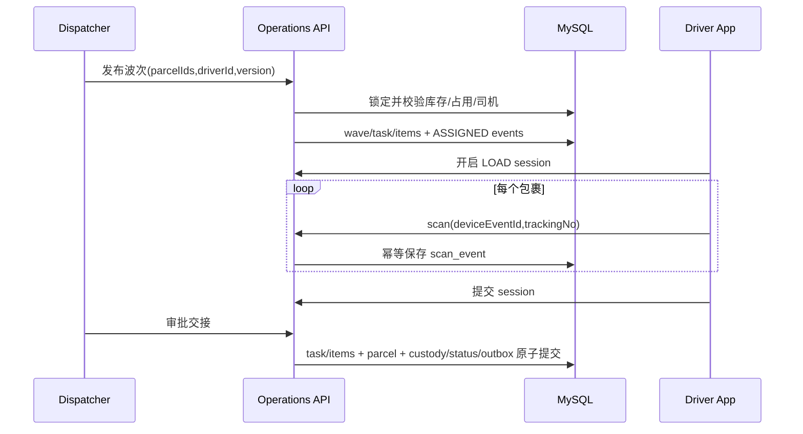
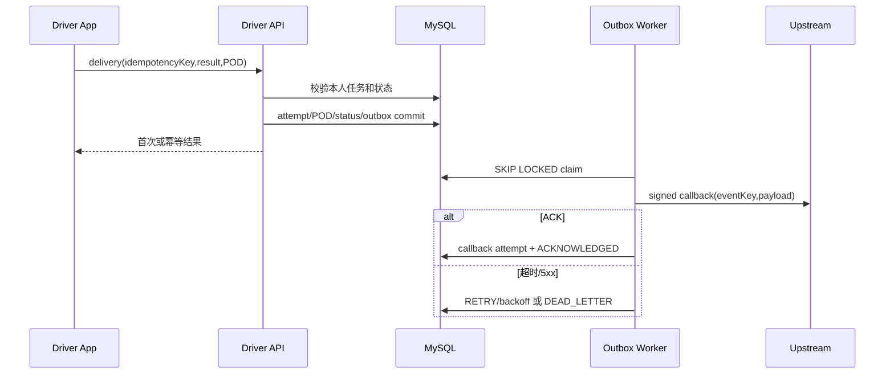

# OpenDelivery 顶层系统设计

## 1. 设计目标、现状与边界

系统采用 Java 17、Spring Boot 3.3、MySQL 8 和 Flyway。当前代码是 Maven 模块化单体，已具备司机认证、任务查询、扫描、派送/POD、Canonical 上游推送、基础运营命令和 Outbox。目标是在保持单体部署简单性的同时，支撑同一部署中的多个城市、每城一个站点；不建设组织层级、站间转运或微服务。

系统包含两个产品子系统：Driver App Backend 和 Operations System（Web + API）。Integration API 是共享平台入口，不作为独立产品。



## 2. 模块职责与依赖

### 2.1 当前物理模块

| 模块 | 当前职责 | 允许依赖 |
|---|---|---|
| `easydelivery-app` | 启动、配置、Integration/Operations API、调度任务 | auth/delivery/scan/common |
| `easydelivery-auth` | 司机注册、登录、刷新、退出 | common |
| `easydelivery-delivery` | 司机任务、派送尝试、POD | common |
| `easydelivery-scan` | 扫描会话和扫描事实 | common |
| `easydelivery-common` | 契约、Repository 接口、JDBC 实现、通用异常 | Spring/JDBC；不得反向依赖业务模块 |

当前 `common` 同时包含领域与基础设施，后续先按 package 建立边界，再视团队规模物理拆分。

### 2.2 目标逻辑模块

- `identity-access`：司机/运营用户、会话、角色和站点权限。
- `partner-integration`：Partner Adapter、验签、接入、隔离、回调和重放。
- `shipment-routing`：地址标准化、服务范围匹配、站点选择和路由异常；代码拥有决策逻辑。
- `shipment`：Waybill、Parcel、客户指令和生命周期。
- `station-operations`：Manifest、收货、库存、差异和日终。
- `dispatch`：Wave、Task、分配、发布门禁、改派和 closeout。
- `driver-execution`：Scan Session、Delivery Attempt、POD 和离线同步。
- `case-management`：异常 owner、SLA、动作和解决方案。
- `platform-infrastructure`：MySQL、对象存储、Outbox、审计、日志和指标。

依赖方向固定为 `API Adapter → Application Service → Domain → Repository Port`，基础设施实现 Repository Port。Controller 不编排跨实体事务，Repository 不决定业务状态转换，模块不得直接更新其他模块拥有的表。

## 3. 核心组件关系



Application Service 定义事务边界。例如“批准装车交接”在一个事务中锁定任务与包裹、校验差异、更新任务明细和当前态、追加 custody/status event、写 Outbox；任一步失败则全部回滚。

## 4. 主业务流程



流程中的业务事实分别记录在 Waybill/Parcel、Manifest、Wave/Task、Scan、Custody、Attempt/POD、Case、Outbox/Callback 和 Reconciliation 中，不能以一个 Parcel 状态代替全部事实。

## 5. 主时序

### 5.1 上游接入与站点路由



### 5.2 波次、装车和责任交接



### 5.3 派送和可靠回传



## 6. Token、权限与外部 API 安全

### 6.1 Driver Token

登录验证 BCrypt 后签发 2 小时 Access JWT 和不透明 Refresh Token。JWT `sub` 是 driver ID；Interceptor 验证签名、过期和数据库会话是否撤销，并把 driver ID 写入 request context。业务层从 context 取身份，不信任请求中的 `driver_id`。Refresh Token 只保存 SHA-256 hash，每次刷新旋转 access/refresh；退出撤销会话。MOV 应补充设备 ID、密钥版本、登录限流和多设备策略。

### 6.2 Operations Token 与 RBAC

目标机制与司机身份分离。运营 JWT 包含 user ID，不直接信任角色 claim；服务端读取有效角色及站点授权。授权至少检查 `role + action + stationId`，并审计高风险命令。现有 `X-Ops-Api-Key` 只作为过渡内部机制，I02 后废弃。

### 6.3 Partner 安全

MOV 为每个 Partner 独立凭证，并使用 TLS、HMAC-SHA256、`X-Partner-Code`、`X-Timestamp`、`X-Nonce`、`X-Signature`。签名覆盖 method、path、timestamp、nonce 和 body SHA-256；允许时钟偏差 5 分钟，nonce 在窗口内唯一。Partner 级限流、请求体上限和审计启用。密钥仅从 Secret 管理加载，支持版本和轮换。当前全局 `X-Upstream-Api-Key` 是基础实现，不能作为多客户最终方案。

## 7. 站点路由与多上游适配

`ShipmentRoutingService` 接收标准化地址和 service code，读取当前有效 `station_service_area`，按“完整邮编/最长前缀 → 城市+省+国家 → priority”确定唯一活动站点。代码负责算法、优先级、冲突和状态门禁；配置表只描述覆盖范围。输出为 `ROUTED/UNROUTABLE/AMBIGUOUS`，Waybill 保存当前结果。无需保存候选站点和每个判断步骤；失败进入 Case，人工覆盖进入通用审计。包裹实物到站后禁止自动重路由。

所有在线操作以 `station_id` 为业务上下文：Manifest、Parcel、Wave、Task、Driver 和 Reconciliation 必须一致。普通运营用户固定默认站点，管理员可切换；这不是复杂多租户体系，但后端必须拒绝跨站点业务混用。所有站点使用统一业务时区规则，各自独立日终。

```java
interface PartnerAdapter {
    boolean supports(String partnerCode, String contentType);
    CanonicalShipment parseAndValidate(byte[] rawPayload);
    PartnerCallback mapOutbound(DomainEvent event);
}
```

请求先保存原文/摘要，再由 Adapter 转成 Canonical Model。简单字段和枚举映射使用有版本的配置；复杂拆单、合单、签名或回调顺序使用代码。MOV 只有 `GenericCanonicalJsonAdapter`；第二个真实 Partner 到来时才实施完整框架并用契约测试验证。

## 8. 一致性、并发与幂等

- 领域更新、不可变事件和 Outbox 同事务提交。
- 可变聚合使用 `version` 乐观锁；发布波次等争抢资源的命令使用短事务行锁。
- 外部事件：`partner_id + external_event_id`；扫描：`device_event_id`；派送：`driver_id + idempotency_key`。
- 幂等记录应同时保存请求 hash；同一 key 不同 payload 返回 `409 IDEMPOTENCY_KEY_REUSED`。
- Outbox 使用 `FOR UPDATE SKIP LOCKED` 领取、带 lease、指数退避和死信；重放不改历史。
- 所有时间在数据库存 UTC，API 使用 ISO-8601 offset datetime，站点日界线按 station timezone 计算。

## 9. 文件、隐私与审计

POD 二进制存对象存储，MySQL 仅保存 URI、hash、类型、大小和采集时间。上传需限制 MIME、扩展名、大小和数量，随机对象键，异步恶意文件扫描；读取使用短期授权 URL。姓名、电话、地址、位置和 POD 均为敏感数据，日志脱敏、传输加密、备份加密，并按 Partner 合同归档或匿名化。审计事件追加写，不与普通业务日志混用。

## 10. 可观测性、SLO 与部署

日志关联 `requestId/partnerId/batchId/parcelId/taskId/driverId`。MOV 指标包括接入拒绝、入站差异、开放任务、司机持有、POD 缺失、Case 超 SLA、Outbox depth/dead letter 和回调延迟。首轮试运营建立基线；`1.0` 再批准正式 SLO。健康检查分别覆盖进程、数据库、对象存储和回调依赖。

部署保持单应用 + MySQL + 对象存储。Flyway 仅前向迁移；发布遵循 expand/migrate/contract，应用和数据库变更向前/向后兼容至少一个版本。备份恢复、迁移 dry-run、Smoke Test 和回滚条件是发布门禁。

## 11. 演进顺序

`0.5 MOV` 先补多城市站点路由、运营 RBAC、入站差异、发布门禁、双边交接、失败回站、Case、回传台和逐站点日终；`1.0` 再补 Partner Adapter、监控、灾备和容量验证；只有出现独立扩容、故障隔离或团队所有权需求时才评估拆服务。
