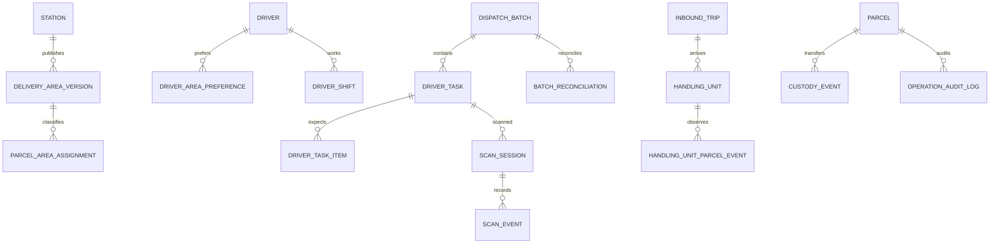

# 运营系统信息架构与领域设计

## 设计原则与关系

商业指令、计划、实物观察、责任和异常是五个正交维度。`Parcel.status` 只是查询投影，不能替代区域快照、任务归属、扫描事实、位置、custody、Case 和审计。命令由服务端状态机校验，客户端不能任意指定目标状态。

`delivery_area` 保存稳定身份和站点；`delivery_area_version` 保存 `MULTIPOLYGON SRID 4326`、GeoJSON 快照、版本、`DRAFT/VALIDATED/PUBLISHED/RETIRED`、生效区间和审批人。正式同层区域不得重叠，边界点视为覆盖。`parcel_area_assignment` 保存 area/version/source/reason，使新边界不追溯改变冻结任务。

`driver_area_preference` 表达长期默认，`driver_shift` 表达营业日运力，`batch_area_assignment` 表达本批次实际决定，不能在区域上固定 driver。现有 `dispatch_wave` 演进为 Dispatch Batch，允许从已路由有效订单池创建，不再要求先 `AT_STATION`；发布只产生计划和应扫清单，不产生 custody。

`inbound_trip/handling_unit` 新增物理运输视角。现有 `inbound_manifest` 保留为预报/兼容入口，不再作为唯一实收到仓事实。Scan Event 增加任务、批次、handling unit、结果和拒绝原因；只有正确司机 `EXPECTED` 是有效领取，破损阻断，错任务等只观察审计。Batch Reconciliation 从全部任务/扫描事实重算。

任务审批锁定 task/items/parcels，重新校验正确司机扫描、冲突和当前 custody，之后原子写入 `STATION → DRIVER`。未观察到的包裹不得转移。

## 信息架构

顶栏固定站点、营业日、角色、告警和待处理数。一级导航：今日运营；订单与地图；批次规划；到仓与扫描；交接审批；派送监控；异常中心；日终关站；配置。

- 今日运营显示计划/实际、司机、到仓、扫描、审批、在途、回仓和日终阻断。
- 订单与地图显示聚类/热力、区域边界、未分区、阻断及包裹抽屉。
- 批次规划组合区域池、司机容量、任务卡片、预检、冻结、发布和改派。
- 到仓与扫描组合车次、板、司机进度、错扫归位和批次核对。
- 交接审批折叠正常任务，只展开未提交、破损和跨司机冲突。
- 派送监控并列计划/实际、最后活动、尝试、司机持有和回仓。

地图与列表共享筛选和选择集；高层级使用服务端聚类，放大后才取单点。包裹详情在当前页面抽屉打开，不丢失视口和批量选择。

## 改派、审计与现有实现

统一 `requestReassignment` 返回 `DIRECT`、`REMOVE_AND_RESCAN`、`RETURN_THEN_ASSIGN`、`BILATERAL_HANDOVER` 或 `NOT_ALLOWED`，不得直接覆盖 driver。MOV 实现前三种，现场司机交接延期。

业务事件表记录事实；`operation_audit_log` 记录 actor/role/station/action/resource/outcome/reason/before/after/request/device/time；技术日志只用于运维。成功、失败和拒绝均进入统一对象时间线。

| 现有能力 | 处置 |
|---|---|
| 上游幂等、站点路由、RBAC、审计、Outbox | 保留扩展 |
| Wave/Task/活动任务唯一约束 | 保留表与约束，放宽到仓前规划门禁并扩展状态 |
| LOAD Session、本人隔离、审批 custody | 保留骨架，增加拒绝结果、板和批次核对 |
| 运营逐件 Inbound Manifest | 保留特殊/兼容流程，不再作为标准主链 |
| 当前入站差异决策 | 迁移到到仓/扫描差异，避免重复模型 |
| POD、失败、RETURN | 保留并接入新任务、审计与日终 |
