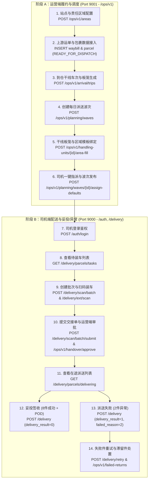

# 🧪 端到端全流程测试方案与自动化集成验证规范 (E2E Test Plan)

## 📌 一、 测试方案概述与业务闭环架构

本方案旨在为 `EasyDelivery` 快递配送系统提供全链路、闭环式的端到端（E2E）自动化测试覆盖。测试链路横跨 **运营端 (Operations Hub)** 与 **司机端 (Driver App)** 两个独立域，涵盖从最初的“站点/区域配置”、“上游包裹与干线车次接入”、“派送波次创建与排线指派”，一直到移动端“司机登录”、“扫码装车交接”、“运营交接审批”、“在途派送妥投（POD照片）”以及“派送失败重试与滞留件处置”的全生命周期。



---

## 📑 二、 阶段级测试用例与 DoD (完成定义) 规范

### 1. 运营端调度阶段 (Operations Hub)

| 用例编号 | 业务步骤 | 接口契约 / 数据库动作 | 输入数据/入参 | 预期断言与 DoD 验证 |
| :--- | :--- | :--- | :--- | :--- |
| **TC-OPS-01** | 责任区域与司机偏好配置 | `POST /ops/v1/areas` | `areaCode="AREA-E2E-01"`, `stationId=1` | 区域创建成功，`status='ACTIVE'`；绑定默认司机 `Driver-101` 偏好。 |
| **TC-OPS-02** | 上游数据模拟接入 | `INSERT waybill & parcel` | 10 件包裹，状态 `READY_FOR_DISPATCH` | 10 件包裹 `current_station_id=1`，`current_area_id` 指向测试区域。 |
| **TC-OPS-03** | 到仓干线车次生成 | `POST /ops/v1/arrival/trips` | `externalTripNo="TRIP-E2E-888"`, 2个板笼 | 车次状态为 `EXPECTED` / `ARRIVED`，自动生成 2 个板笼 (`PALLET`)。 |
| **TC-OPS-04** | 创建每日派送波次 | `POST /ops/v1/planning/waves` | `serviceDate="2026-07-25"`, `waveCode="20260725-WAVE-01"` | 生成 `dispatch_wave` 记录，关联波次编号 `20260725-WAVE-01`，状态为 `DRAFT`。 |
| **TC-OPS-05** | 板笼与区域模板绑定 | `POST /ops/v1/handling-units/{id}/area-fill` | `deliveryAreaIds=[AREA_ID]` | 板笼成功持久化挂载对应区域，`link_source='AREA_PLAN'`，无重复脏数据。 |
| **TC-OPS-06** | 司机一键指派与发布 | `POST /ops/v1/planning/waves/{id}/assign-defaults`<br/>`POST /ops/v1/planning/waves/{id}/publish` | `waveId` | 为司机自动生成 `driver_task`；波次状态切为 `PUBLISHED`；包裹状态切为 `ASSIGNED`。 |

---

### 2. 司机端履约与异常处理阶段 (Driver App Hub)

| 用例编号 | 业务步骤 | 接口契约 (真实原生无 `/v1`) | 输入数据/入参 | 预期断言与 DoD 验证 |
| :--- | :--- | :--- | :--- | :--- |
| **TC-DRV-01** | 司机登录鉴权 | `POST /auth/login` | `credential_id="driver101"`, `password="123456"` | 返回 HTTP 200，获取 `access_token` (Bearer) 与 `refresh_token`。 |
| **TC-DRV-02** | 查看待装车任务 | `GET /delivery/parcels/tasks` | `driver_id=101`, `criteria="UNSCANNED"` | 返回在 Step A6 中指派的 10 件包裹，包含追踪号和派送地址。 |
| **TC-DRV-03** | 批次创建与扫码装车 | `POST /delivery/scan/batch`<br/>`POST /delivery/ext/scan` | `scan_batch_id`, `tracking_no` | 批次创建成功；10 件包裹依次扫码通过，校验逻辑无报错。 |
| **TC-DRV-04** | 批次提交与交接审批 | `POST /delivery/scan/batch/submit`<br/>`POST /ops/v1/handover/approve` | `scan_batch_id` | 交接单变为 `APPROVED`；10 件包裹状态由 `ASSIGNED` 自动切为 `OUT_FOR_DELIVERY`。 |
| **TC-DRV-05** | 查看在途派送列表 | `GET /delivery/parcels/delivering` | `driver_id=101` | 司机端在途列表返回 10 件待派送包裹。 |
| **TC-DRV-06** | 妥投签收 (8件成功) | `POST /delivery` (Multipart) | `order_id`, `delivery_result=0`, `pod_images[]` | 8 件包裹状态更改为 `DELIVERED`，成功持久化保存 POD 图片与签收人坐标。 |
| **TC-DRV-07** | 派送失败 (2件异常) | `POST /delivery` (Multipart) | `order_id`, `delivery_result=1`, `failed_reason=2` | 2 件包裹状态更改为 `DELIVERY_FAILED`；在运营端生成少货/派送失败工单。 |
| **TC-DRV-08** | 失败件重试与滞留处置 | `POST /delivery/retry`<br/>`POST /ops/v1/failed-returns` | `order_id`, `driver_id` | 支持司机二次发起派送重试；运营端可在滞留件工作台进行退回上游或重新指派。 |

---

## 🛡️ 三、 生产环境影子测试与防污染隔离方案 (Production Shadow Testing & Data Protection)

为确保在生产环境进行全流程探针测试时不污染真实报表、不给真实司机派单、不向真实客户发送通知，系统统一采用**“影子全链路染色与隔离策略”**：

### 1. 核心隔离机制
- **上下文染色 (Shadow Header)**：自动化巡检脚本在 HTTP 请求头添加 `X-Shadow-Test: true`，API 网关/过滤器解析并透传染色属性；
- **测试司机隔离 (Shadow Driver Account)**：影子测试单仅指派给 `is_test_driver = 1` 的专用测试司机账号（例如 `driver_test_01`），真实司机端 App 无法感知；
- **推送/短信自动 Mock**：消息推送服务检测到 `is_test = 1` 的包裹事件时，自动重定向至 Mock 存根，不触达真实手机号；
- **报表与控制塔过滤 (Control Tower Exclusion)**：所有运营 KPI 统计 SQL 强制包含 `WHERE p.is_test = 0`，确保生产看板与结算账单 100% 干净；
- **数据生命周期自动闭环与 TTL 清理**：影子测试单据在完成 E2E 测试后自动落入关单终态，由定时任务对超过 7 天的历史影子测试记录进行清理。

---

## 🛠️ 四、 自动化集成测试套件验证命令

运行项目封装的单元与集成测试脚本，验证整个后端系统的完整性：

```bash
./run.sh test
```
