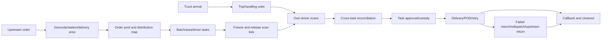

# Operations System Product Model

> Localization is end-to-end: Operations Web, Driver App, and both API surfaces initially support `en-CA`, `fr-CA`, and `zh-CN`; locale changes never alter state, authorization, station isolation, or audit semantics.

The Operations System is the city-station last-mile control plane, not a generic WMS, map editor, or database console. It closes the loop across upstream orders, geographic planning, physical arrival, driver pickup, custody, delivery, returns, and daily sign-off. The first outcome is five consecutive business days in YHZ, YYZ, and YVR under a one-city/one-station model; optimization, real-time dispatch, inter-station transfer, and organization hierarchy are excluded.

Operations and the driver product are planned independently. The Driver App/API performs the authenticated driver's scans, delivery, and return; Operations prepares plans, observes driver events, approves custody transfer, and resolves exceptions. It never scans on behalf of a driver. Shared domain facts do not imply shared client permissions.

The model separates commercial `Waybill/Parcel`, low-change `Station Service Area`, versioned GeoJSON `Delivery Area`, long-term `Driver Area Preference`, daily `Driver Shift`, pre-arrival `Dispatch Batch/Driver Task`, physical `Inbound Trip/Handling Unit`, immutable `Load Scan Event`, cross-task `Batch Reconciliation`, `Custody Event`, delivery/POD/return records, and Case/audit history.

Upstream never needs internal station or driver knowledge. The system performs idempotent intake, geocoding, station routing, and delivery-area matching. Operations runs the business day around an arrival batch: after each upstream push (there may be several), parcels are auto-routed to the station and auto-matched into delivery areas, with recompute available. The station plans an arrival batch number as the single identifier of the run; about ten handling units are generated under it by default instead of being keyed in one by one. Unit loading is area-driven: the operator picks areas (1-N), reviews the parcels on the map, and every parcel in the area auto-links to the unit — map picks or manual entry are only occasional supplements. The upstream warehouse sorts and packs against the plan, the truck arrives, the operator confirms arrival, and drivers scan; plan-versus-physical gaps become exceptions. Dispatch planning starts after the first push, before truck arrival, and continues incrementally with later pushes; plan codes are auto-generated or reuse the arrival batch number, never hand-typed. Driver capacity defaults to available — only exceptions such as leave or sickness are recorded; a driver bound to areas (1-N) receives that batch's parcels of those areas by default, with occasional map adjustments. Design principle: anything the system can derive is never keyed in line by line; humans handle exceptions only; screens follow the work flow to minimize clicks and jumps. A batch moves through `DRAFT → FROZEN → RELEASED_FOR_SCAN → SCANNING → RECONCILING → IN_PROGRESS → CLOSED`.

Trips and handling units represent physical arrival independently from dispatch planning. A pallet may contain parcels for many drivers, and one task may span many pallets. Upstream shipment payloads may declare per-waybill unit packing lists (`handlingUnits`); the system stores them as facts only and auto-links same-station parcels when an operator registers the matching handling unit. The coverage view shows expected/linked/scanned/exception counts with parcel drill-down whose aggregate always equals its detail; auto-linkage never changes parcel status or custody. A driver can effectively scan only own-task parcels. `WRONG_TASK`, `WRONG_BATCH`, `UNKNOWN`, and `DUPLICATE` remain rejected observations and never alter membership, valid counts, or custody. Missing is derived from expected minus valid scans.

Operations sees progress continuously. Reconciliation completes after required submissions or supervisor exception-close. Only conflict-free parcels validly scanned by the assigned driver can be approved; approval atomically appends task/parcel projections, custody, status, audit, and outbox facts. Reassignment is state-aware and never blindly overwrites a driver.

Operators manage areas, batches, and tasks by default. Map, area list, driver board, and parcel list stay synchronized; maps show distribution while lists provide bulk precision. Parcel drawers retain context and show area/version, task, handling unit, custody, and timeline. Versioned GeoJSON areas require geometry, overlap, boundary, impact, approval, and audit checks before publication.

The home page is a business-day control tower. Journey navigation follows order readiness, dispatch planning, inbound arrival, driver scan, handover approval, delivery monitoring, and day close, with low-frequency configuration separated. Metrics drill into detail and fact-derived stage status produces prioritized next actions. See [Operations Control Tower and Journey Navigation](operations-control-tower.en.md).

Business events, operation audit, and technical logs remain separate. MOV acceptance requires zero cross-station or duplicate active assignment, no mutation from rejected scans, correct-driver evidence for every approved parcel, custody conservation, and explained closeout variance.
