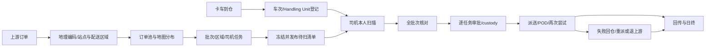

# 运营系统产品模型

> 多语言是全流程能力：运营 Web、司机 App 与两类 API 首期支持 `en-CA`、`fr-CA`、`zh-CN`；语言切换不得改变状态、权限、站点隔离或审计语义。

## 定位、用户与目标

运营系统是城市站点的 Last Mile 控制台，不是通用 WMS、地图工具或数据库后台。它把上游订单、区域规划、实际到仓、司机领取、责任交接、配送、回仓和日终组织成可追溯闭环。首个目标是让 YHZ、YYZ、YVR 各自以“一城一站”模式连续运营五个营业日；不建设自动路线优化、实时调度、站间转运和复杂组织层级。

运营系统与司机产品独立规划：司机 App/Driver API 执行本人扫描、派送和回仓；运营系统只准备计划、观察司机事件、审批责任转移和处理异常，不提供“代司机扫描”功能。共享领域事实不代表共享客户端权限。

| 角色 | 核心动作 |
|---|---|
| 上游 | 提供订单、包裹、更新/取消及可选运输预报 |
| 调度员 | 查看地图分布，按区域/运力建立批次和司机任务 |
| 到仓运营 | 登记车次/板、监控扫描、隔离异常实物 |
| 司机 | 仅扫描本人任务包裹，提交领取、配送或退仓 |
| 主管 | 处理差异、审批 custody、受控改派和日终签字 |

## 核心对象

- `Waybill/Parcel`：商业指令与可扫描物理件。
- `Station Service Area`：决定订单属于哪个城市站点，变化低频。
- `Delivery Area`：站内 GeoJSON 配送小区，支持版本、发布与回退。
- `Driver Area Preference/Driver Shift`：长期熟悉区域与当天出勤/容量。
- `Dispatch Batch/Driver Task`：到仓前的派送计划与每名司机应扫清单。
- `Inbound Trip/Handling Unit`：实际卡车车次与板、托盘或笼车。
- `Load Scan Session/Event`：司机本人领取包裹的会话与不可变观察事实。
- `Batch Reconciliation`：跨司机汇总应扫、实扫、漏扫、错扫、重复、破损和未知。
- `Custody Event`：站点、司机和上游之间的责任转移。
- `Delivery Attempt/POD/Return Session`：配送、证据与失败回仓。
- `Operational Case/Audit Event`：人工异常与成功、失败、拒绝操作。

## 实际运营主流程

上游无需提供内部站点或司机。系统幂等接入、地理编码、站点路由和 Delivery Area 匹配。匹配顺序为人工包裹覆盖、有效 Polygon/MultiPolygon、邮编/城市回退、未分区异常。站点服务范围与站内配送区域分离。

运营以“到仓批次”为营业日主轴。上游推送原始订单（可能多次）后，系统自动完成站点路由与包裹区域归属计算（支持再次计算）。站点规划到仓批次号作为当次运作的统一标识；批次下默认生成约 10 个板/笼，避免逐个人工新增。板/笼装载按区域（1-N）自动关联：运营选择区域并在地图核对后，区域内包裹自动挂入板/笼；地图点选或手工输入仅作偶尔补充。上游仓库按规划分拣打包、卡车运输到站，运营确认到库后司机扫描分拣，实物与计划的差异进入异常。

派送规划在卡车到达前、上游首次推送后即可进行，并随多次推送对增量包裹继续处理；计划编码自动生成或复用到仓批次号，无需人工编号。运力默认全部可用，只需登记请假、生病等例外；司机绑定区域（1-N）后默认直接分得本批次所属区域的包裹，地图上偶尔调整。设计原则：能由系统推导的数据绝不让运营逐行录入，人工只处理例外；界面按作业流组织，减少点击与跳转。区域默认司机只是建议；大区域可按稳定子区拆分，MOV 不承诺最优路线。批次状态为 `DRAFT → FROZEN → RELEASED_FOR_SCAN → SCANNING → RECONCILING → IN_PROGRESS → CLOSED`。

到仓运营登记卡车、承运方、到达、板数、铅封和外包装异常。Handling Unit 与派送任务独立：一个板可含多个司机区域，一个任务可横跨多个板。上游接入报文可按运单声明板/笼清单（`handlingUnits`），系统只记录声明事实；运营登记同名 Handling Unit 时自动关联本站包裹。覆盖视图展示预计/已关联/已扫/异常并可钻取包裹明细，聚合恒等于明细汇总；自动关联不改变包裹状态与 custody。

司机只能有效扫描本人任务。`WRONG_TASK/WRONG_BATCH/UNKNOWN/DUPLICATE` 保存为拒绝型观察，但不加入任务、不计有效扫描、不转移 custody。错任务实物线下交运营或正确司机；正确司机必须本人重扫。`MISSING` 由“应扫−有效已扫”计算，不伪造扫描事件。

运营实时看到扫描进度；所有必要任务提交或主管例外关闭后完成全批次核对。只有正确司机有效扫描且无跨任务冲突的包裹可批准。审批在一个事务中更新任务/包裹并追加 custody/status/audit/outbox；提交扫描本身不转移责任。

所有页面可发起改派，但按状态执行：未扫描前直接受控改派；已扫描未审批需原会话移除且新司机重扫；司机已持有需先退站或正式双方交接；已妥投不可改写历史。

## 运营体验、区域与审计

运营默认管理区域、批次和司机任务，不逐件处理正常包裹。地图、区域列表、司机任务和包裹列表双向联动；地图聚类/热力用于分布，列表用于批量和精确操作。包裹抽屉展示订单、区域版本、任务、板、位置、custody 和统一时间线。命令先预检，完整成功或完整拒绝。

首页采用“营业日控制塔”，流程导航按订单准备、派送规划、到仓接收、司机扫描、交接审批、派送监控和日终关站排列，低频配置独立分组。指标必须可钻取，系统根据事实生成阶段状态和下一步行动。详细规格见 [运营控制塔与流程导航](operations-control-tower.md)。

Delivery Area 使用版本化 GeoJSON。运营可从 geojson.io 导入或在内嵌地图编辑草稿；系统校验几何、站点越界、同层重叠、未覆盖和影响包裹，经审批发布。冻结任务保留区域版本快照。

业务事件、操作审计和技术日志分离。包裹、区域、批次、任务、板和 Case 均可查询谁在何时做了什么、前后值、原因及成功/失败/拒绝。MOV 要求跨站和重复活动任务为零，错任务扫描不改变任务/custody，批准件均有正确司机扫描证据，责任守恒且日终差异有 Case 或签字结转。
