# OpenDelivery Integrated Product and Operations Specification

> **Superseded:** The standard path is defined by the [Operations System Product Model](operations-system-product-model.en.md). This file remains as early requirement history.

## 1. Positioning and First Objective

OpenDelivery is a last-mile fulfillment platform with a **Driver Operations subsystem** and an **Operations Management subsystem**, supported by integration, station routing, and fulfillment capabilities. Its first objective is not benchmark parity: one station in each of multiple cities must complete receiving, dispatch, handover, delivery, exception handling, callback, and closeout without querying the database.

The MOV supports multiple cities in one deployment, exactly one station per city, one common business-timezone policy, Canonical JSON upstreams that provide address/service data rather than internal station IDs, system routing through versioned service-area rules, manual waves, and Driver App execution. Organization hierarchy, multiple stations per city, inter-station transfer, route optimization, live GPS, COD, billing, customer portal, and SFTP/PULL are out.

## 2. Users and Responsibilities

| Actor | MOV responsibility | Entry point |
|---|---|---|
| Upstream system | Send address/service/parcel data and receive callbacks; no internal-station knowledge | Integration API |
| Inbound operator | Unload scans and discrepancies | Operations system |
| Dispatcher | Select parcels, build waves, assign drivers | Operations system |
| Station supervisor | Approve discrepancies/handover and sign off day | Operations system |
| Driver | Accept, load, deliver, and return parcels | Driver App/API |
| Exception agent | Resolve address, refusal, damage, and similar cases | Operations system |
| Integration operator | Resolve callback dead letters/reconciliation | Operations system |

The upstream owns commercial shipment instructions. OpenDelivery owns station inventory, custody, and last-mile execution facts after physical receipt.

## 3. Business Objects

- **Waybill**: upstream commercial shipment; may contain multiple parcels.
- **Parcel**: uniquely tracked physical piece.
- **Ingestion Batch**: one push, pull page, or file.
- **Inbound Manifest**: parcels expected at a station.
- **Dispatch Wave**: service-date/route delivery plan.
- **Driver Task**: work assigned to one driver.
- **Scan Session**: load, return, or transfer scan operation.
- **Delivery Attempt**: one successful or failed visit.
- **Operational Case**: an exception with owner and SLA.

These objects are not interchangeable: a scan session does not create shipment data, and a task assignment does not prove custody transfer.

## 4. Minimum Operable Closed Loop

```mermaid
flowchart LR
 A[Upstream address/shipment] --> B[Validate/idempotently persist]
 B --> B1[Normalize and route station]
 B1 --> C[Station inbound manifest]
 C --> D[Physical receipt scan]
 D --> E{Match?}
 E -- No --> F[Case/supervisor decision]
 E -- Yes --> G[Dispatchable inventory]
 F --> G
 G --> H[Wave and driver assignment]
 H --> I[Driver load scan]
 I --> J[Approved custody transfer]
 J --> K{Delivery result}
 K -- Success --> L[POD and delivered]
 K -- Failure --> M[Reason and return/reschedule]
 L --> N[Upstream callback]
 M --> N
 N --> O[Daily reconciliation/sign-off]
```

### 4.1 Ingestion

The upstream sends by `partnerCode + externalEventId` and supplies country, province, city, postal code, address lines, and service requirements—not an internal station. The system records a digest and validates input; the Routing module normalizes the address and deterministically selects one active service-area rule. Success creates waybill, parcels, and a station manifest. No/ambiguous match creates a routing Case and no dispatchable inventory. MOV supports Canonical JSON only.

### 4.2 Station Receipt

Operators scan physical parcels against a manifest. Matches become `AT_STATION` with `STATION` custody. Missing, extra, wrong-station, damaged, and data-missing pieces become discrepancies. Missing pieces never become available inventory; extras wait for upstream data or supervisor quarantine. A manifest closes only after resolution or signed acceptance.

### 4.3 Dispatch

Dispatchers select dispatchable station inventory and assign date, route, and driver. Publication requires physical station custody, complete data, non-cancelled state, no active task, and an active driver at that station. MOV uses manual selection.

### 4.4 Load and Handover

The driver opens a LOAD session and scans every piece. The system shows expected, scanned, missing, extra, and wrong-task counts. Clean sessions can be submitted; exceptions require supervisor correction or reasoned acceptance. Approval atomically starts the task, moves parcels to `OUT_FOR_DELIVERY`, and transfers custody to the driver.

### 4.5 Delivery, Failure, and Return

Drivers can act only on their own active tasks. Success requires location, time, recipient, and photo POD; failure requires a reason. MOV supports station return or manual next-day rescheduling, not automatic appointment logic. RETURN approval moves custody back to station and creates the appropriate next action/case.

### 4.6 Callback and Closeout

State, immutable event, and outbox commit in one transaction. Failed callbacks retry and eventually enter a replayable dead letter queue. Daily closeout balances opening inventory + inbound - dispatched + returned - delivered against closing inventory and checks driver custody, tasks, POD, cases, and callbacks. Every variance must be resolved or explicitly carried over by a supervisor.

## 5. Rules

- Parcel lifecycle, custody, location, task, case, and callback have separate states.
- Every command checks prior state, authorization, idempotency, and version.
- A parcel has at most one active task.
- A waybill must be `ROUTED` before station inventory; parcel, manifest, wave, task, and driver stations must agree.
- No automatic station change after physical receipt; address changes become Cases and MOV has no inter-station transfer.
- Custody changes only through approved handover events.
- Terminal outcomes require an event, POD or failure reason, and upstream ACK/waiver.
- Every exception has owner, priority, SLA, evidence, action history, and closure reason.

## 6. MOV Scope and Gap

| Capability | Current state | MOV acceptance |
|---|---|---|
| Canonical push | Basic implementation | Remove required upstream station, partner credential, validation, raw record/replay |
| Address and station routing | Missing | service-area configuration, deterministic service, current result, routing Case |
| Multi-city/one-station | Data foundation | city attributes, station context, end-to-end consistency, independent operation |
| Manifest receipt | Partial | Workbench, discrepancy decisions, close gate |
| Wave/task | Partial | Draft, validation, publish, cancel; no duplicate assignment |
| Load handover | Partial | Driver submit, supervisor approval, atomic custody |
| Delivery/POD | Basic implementation | POD policy, file controls, authorized retrieval |
| Failure/return | Not closed | Reasons, RETURN session, station acceptance, reschedule |
| Cases | Data foundation | Queue, owner, SLA, actions, closure |
| Callback workbench | Worker exists | Search, dead letter, replay, ACK visibility |
| Daily close | Data foundation | Balance, variance, sign-off, carryover |
| Operator IAM | Missing | User, role, station grants, audit |

Implementation specifications are in [MOV Mandatory Capability Solutions](mandatory-capability-solutions.en.md).

## 7. Operational Acceptance

MOV requires at least three cities, one station each, to complete five consecutive business days in one deployment. Routing works without upstream station IDs; every cross-station mismatch is rejected; every parcel exposes source, station, location, custodian, next action, SLA, and callback status. Callback eventual success is at least 99.5%, and each station's closeout variances have owners and resolutions.

Initial metrics establish a real baseline: ingestion acceptance, manifest/load discrepancy, first-attempt delivery, failure reasons, driver-held parcels, missing POD, callback delay, and overdue cases.

## 8. Out of MOV

Automatic route optimization, live tracking, ETA, customer portal, COD/settlement, driver pay, vehicle assets, regulated-special handling, SFTP/PULL, inter-station transfer, warehouse, and advanced analytics are deferred.
